# FashionStore Class Diagrams

## Core Entity Classes

### User Class

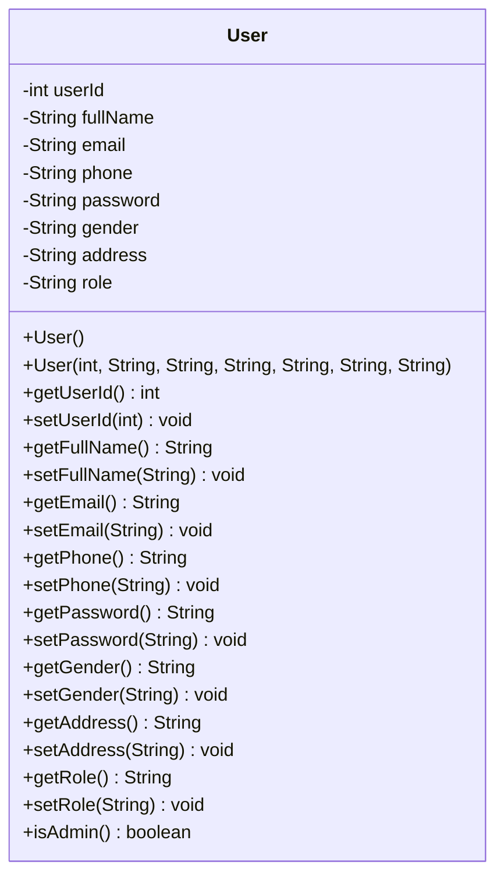
```mermaid
classDiagram
    class User {
        -int userId
        -String fullName
        -String email
        -String phone
        -String password
        -String gender
        -String address
        -String role
        +User()
        +User(int, String, String, String, String, String, String)
        +getUserId() int
        +setUserId(int) void
        +getFullName() String
        +setFullName(String) void
        +getEmail() String
        +setEmail(String) void
        +getPhone() String
        +setPhone(String) void
        +getPassword() String
        +setPassword(String) void
        +getGender() String
        +setGender(String) void
        +getAddress() String
        +setAddress(String) void
        +getRole() String
        +setRole(String) void
        +isAdmin() boolean
    }
```

### Product Class

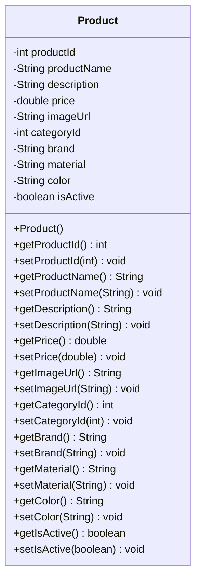
```mermaid
classDiagram
    class Product {
        -int productId
        -String productName
        -String description
        -double price
        -String imageUrl
        -int categoryId
        -String brand
        -String material
        -String color
        -boolean isActive
        +Product()
        +getProductId() int
        +setProductId(int) void
        +getProductName() String
        +setProductName(String) void
        +getDescription() String
        +setDescription(String) void
        +getPrice() double
        +setPrice(double) void
        +getImageUrl() String
        +setImageUrl(String) void
        +getCategoryId() int
        +setCategoryId(int) void
        +getBrand() String
        +setBrand(String) void
        +getMaterial() String
        +setMaterial(String) void
        +getColor() String
        +setColor(String) void
        +getIsActive() boolean
        +setIsActive(boolean) void
    }
```

### ProductSize Class

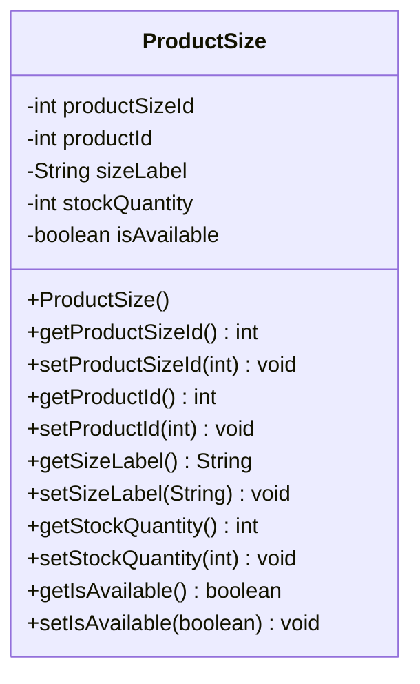
```mermaid
classDiagram
    class ProductSize {
        -int productSizeId
        -int productId
        -String sizeLabel
        -int stockQuantity
        -boolean isAvailable
        +ProductSize()
        +getProductSizeId() int
        +setProductSizeId(int) void
        +getProductId() int
        +setProductId(int) void
        +getSizeLabel() String
        +setSizeLabel(String) void
        +getStockQuantity() int
        +setStockQuantity(int) void
        +getIsAvailable() boolean
        +setIsAvailable(boolean) void
    }
```

### CartItem Class

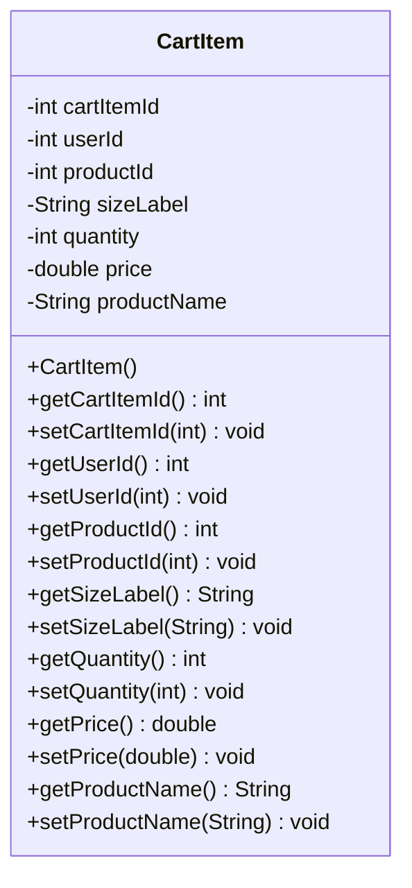
```mermaid
classDiagram
    class CartItem {
        -int cartItemId
        -int userId
        -int productId
        -String sizeLabel
        -int quantity
        -double price
        -String productName
        +CartItem()
        +getCartItemId() int
        +setCartItemId(int) void
        +getUserId() int
        +setUserId(int) void
        +getProductId() int
        +setProductId(int) void
        +getSizeLabel() String
        +setSizeLabel(String) void
        +getQuantity() int
        +setQuantity(int) void
        +getPrice() double
        +setPrice(double) void
        +getProductName() String
        +setProductName(String) void
    }
```

### Order Class

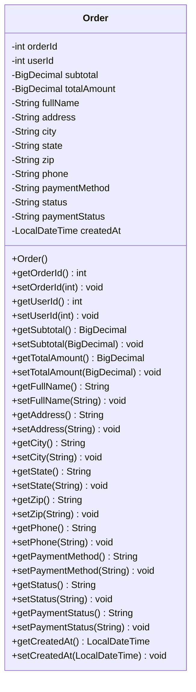
```mermaid
classDiagram
    class Order {
        -int orderId
        -int userId
        -BigDecimal subtotal
        -BigDecimal totalAmount
        -String fullName
        -String address
        -String city
        -String state
        -String zip
        -String phone
        -String paymentMethod
        -String status
        -String paymentStatus
        -LocalDateTime createdAt
        +Order()
        +getOrderId() int
        +setOrderId(int) void
        +getUserId() int
        +setUserId(int) void
        +getSubtotal() BigDecimal
        +setSubtotal(BigDecimal) void
        +getTotalAmount() BigDecimal
        +setTotalAmount(BigDecimal) void
        +getFullName() String
        +setFullName(String) void
        +getAddress() String
        +setAddress(String) void
        +getCity() String
        +setCity(String) void
        +getState() String
        +setState(String) void
        +getZip() String
        +setZip(String) void
        +getPhone() String
        +setPhone(String) void
        +getPaymentMethod() String
        +setPaymentMethod(String) void
        +getStatus() String
        +setStatus(String) void
        +getPaymentStatus() String
        +setPaymentStatus(String) void
        +getCreatedAt() LocalDateTime
        +setCreatedAt(LocalDateTime) void
    }
```

### OrderItem Class

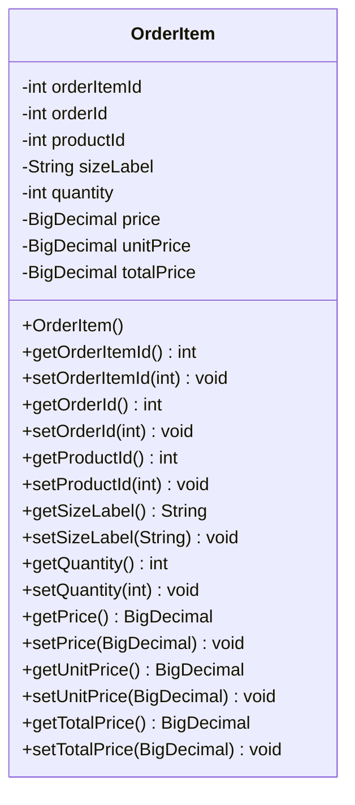
```mermaid
classDiagram
    class OrderItem {
        -int orderItemId
        -int orderId
        -int productId
        -String sizeLabel
        -int quantity
        -BigDecimal price
        -BigDecimal unitPrice
        -BigDecimal totalPrice
        +OrderItem()
        +getOrderItemId() int
        +setOrderItemId(int) void
        +getOrderId() int
        +setOrderId(int) void
        +getProductId() int
        +setProductId(int) void
        +getSizeLabel() String
        +setSizeLabel(String) void
        +getQuantity() int
        +setQuantity(int) void
        +getPrice() BigDecimal
        +setPrice(BigDecimal) void
        +getUnitPrice() BigDecimal
        +setUnitPrice(BigDecimal) void
        +getTotalPrice() BigDecimal
        +setTotalPrice(BigDecimal) void
    }
```

### Review Class

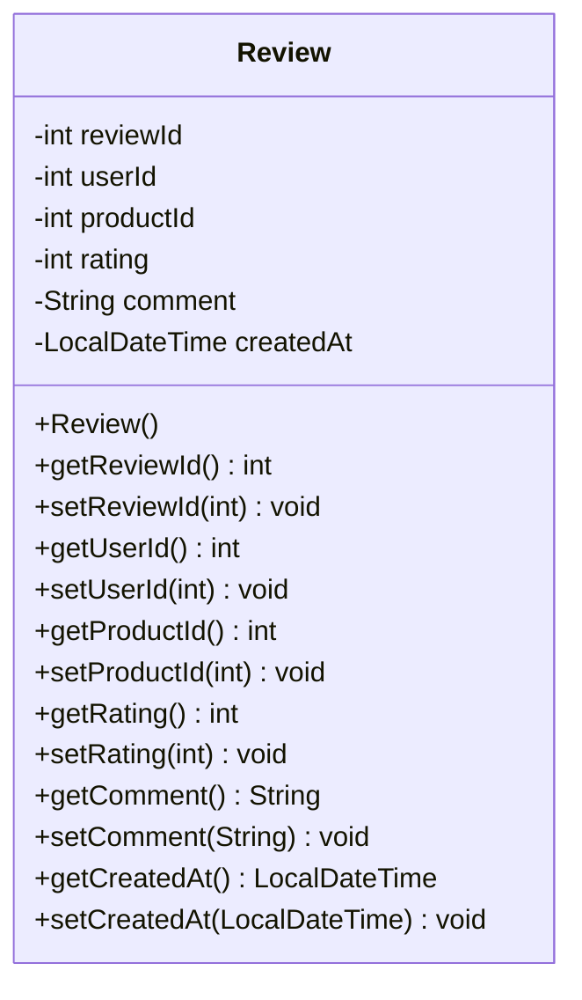
```mermaid
classDiagram
    class Review {
        -int reviewId
        -int userId
        -int productId
        -int rating
        -String comment
        -LocalDateTime createdAt
        +Review()
        +getReviewId() int
        +setReviewId(int) void
        +getUserId() int
        +setUserId(int) void
        +getProductId() int
        +setProductId(int) void
        +getRating() int
        +setRating(int) void
        +getComment() String
        +setComment(String) void
        +getCreatedAt() LocalDateTime
        +setCreatedAt(LocalDateTime) void
    }
```

### WishlistItem Class

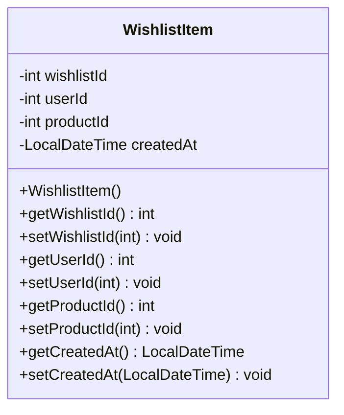
```mermaid
classDiagram
    class WishlistItem {
        -int wishlistId
        -int userId
        -int productId
        -LocalDateTime createdAt
        +WishlistItem()
        +getWishlistId() int
        +setWishlistId(int) void
        +getUserId() int
        +setUserId(int) void
        +getProductId() int
        +setProductId(int) void
        +getCreatedAt() LocalDateTime
        +setCreatedAt(LocalDateTime) void
    }
```

### Category Class

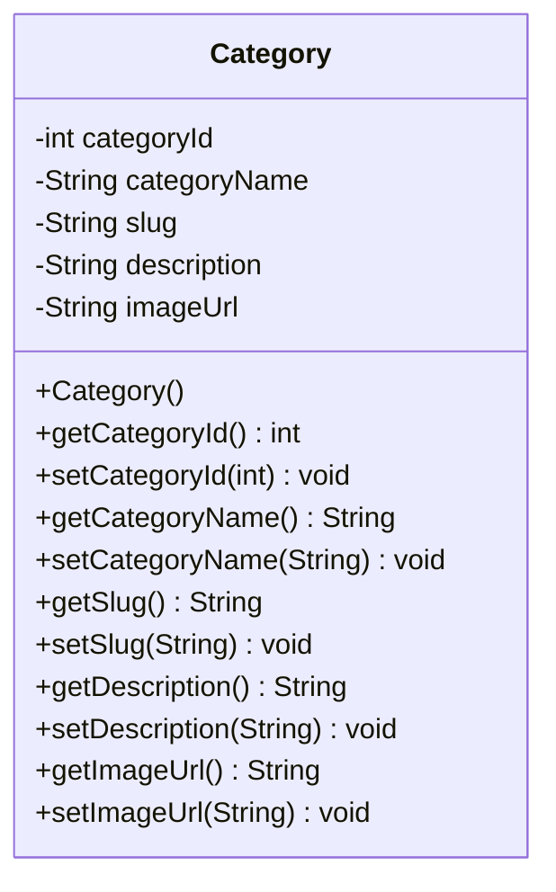
```mermaid
classDiagram
    class Category {
        -int categoryId
        -String categoryName
        -String slug
        -String description
        -String imageUrl
        +Category()
        +getCategoryId() int
        +setCategoryId(int) void
        +getCategoryName() String
        +setCategoryName(String) void
        +getSlug() String
        +setSlug(String) void
        +getDescription() String
        +setDescription(String) void
        +getImageUrl() String
        +setImageUrl(String) void
    }
```

### Payment Class

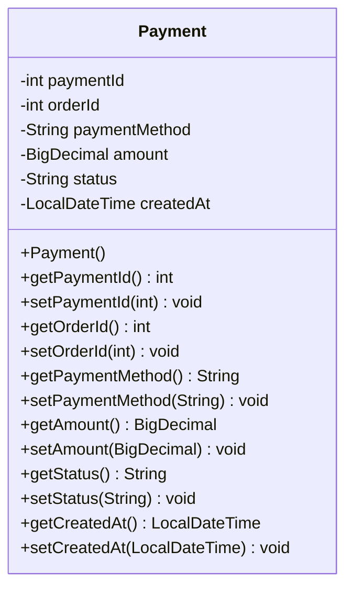
```mermaid
classDiagram
    class Payment {
        -int paymentId
        -int orderId
        -String paymentMethod
        -BigDecimal amount
        -String status
        -LocalDateTime createdAt
        +Payment()
        +getPaymentId() int
        +setPaymentId(int) void
        +getOrderId() int
        +setOrderId(int) void
        +getPaymentMethod() String
        +setPaymentMethod(String) void
        +getAmount() BigDecimal
        +setAmount(BigDecimal) void
        +getStatus() String
        +setStatus(String) void
        +getCreatedAt() LocalDateTime
        +setCreatedAt(LocalDateTime) void
    }
```

## Service Layer Classes

### UserService

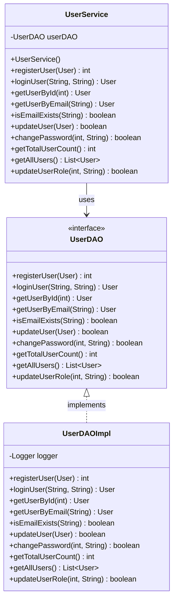
```mermaid
classDiagram
    class UserService {
        -UserDAO userDAO
        +UserService()
        +registerUser(User) int
        +loginUser(String, String) User
        +getUserById(int) User
        +getUserByEmail(String) User
        +isEmailExists(String) boolean
        +updateUser(User) boolean
        +changePassword(int, String) boolean
        +getTotalUserCount() int
        +getAllUsers() List~User~
        +updateUserRole(int, String) boolean
    }
    
    class UserDAO {
        <<interface>>
        +registerUser(User) int
        +loginUser(String, String) User
        +getUserById(int) User
        +getUserByEmail(String) User
        +isEmailExists(String) boolean
        +updateUser(User) boolean
        +changePassword(int, String) boolean
        +getTotalUserCount() int
        +getAllUsers() List~User~
        +updateUserRole(int, String) boolean
    }
    
    class UserDAOImpl {
        -Logger logger
        +registerUser(User) int
        +loginUser(String, String) User
        +getUserById(int) User
        +getUserByEmail(String) User
        +isEmailExists(String) boolean
        +updateUser(User) boolean
        +changePassword(int, String) boolean
        +getTotalUserCount() int
        +getAllUsers() List~User~
        +updateUserRole(int, String) boolean
    }
    
    UserService --> UserDAO : uses
    UserDAO <|.. UserDAOImpl : implements
```

### ProductService

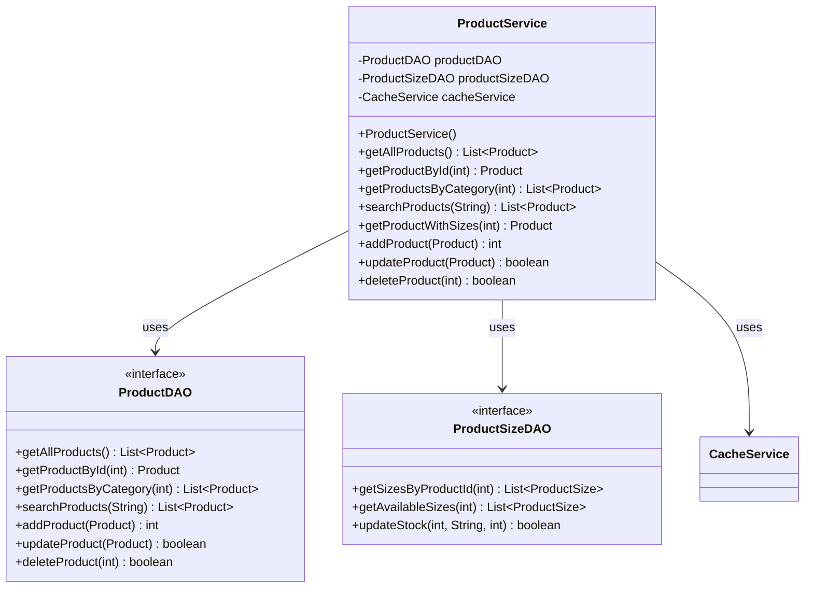
```mermaid
classDiagram
    class ProductService {
        -ProductDAO productDAO
        -ProductSizeDAO productSizeDAO
        -CacheService cacheService
        +ProductService()
        +getAllProducts() List~Product~
        +getProductById(int) Product
        +getProductsByCategory(int) List~Product~
        +searchProducts(String) List~Product~
        +getProductWithSizes(int) Product
        +addProduct(Product) int
        +updateProduct(Product) boolean
        +deleteProduct(int) boolean
    }
    
    class ProductDAO {
        <<interface>>
        +getAllProducts() List~Product~
        +getProductById(int) Product
        +getProductsByCategory(int) List~Product~
        +searchProducts(String) List~Product~
        +addProduct(Product) int
        +updateProduct(Product) boolean
        +deleteProduct(int) boolean
    }
    
    class ProductSizeDAO {
        <<interface>>
        +getSizesByProductId(int) List~ProductSize~
        +getAvailableSizes(int) List~ProductSize~
        +updateStock(int, String, int) boolean
    }
    
    ProductService --> ProductDAO : uses
    ProductService --> ProductSizeDAO : uses
    ProductService --> CacheService : uses
```

### CartService

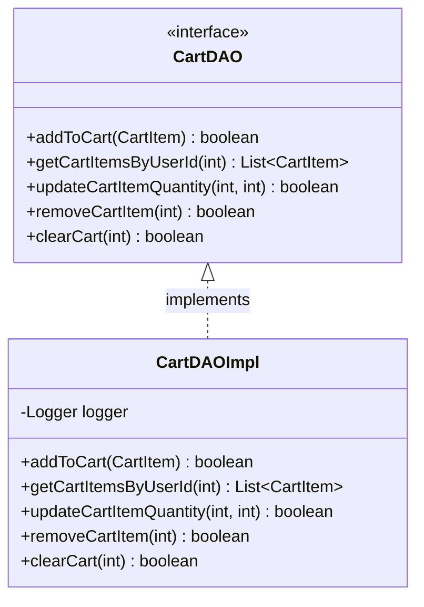
```mermaid
classDiagram
    class CartDAO {
        <<interface>>
        +addToCart(CartItem) boolean
        +getCartItemsByUserId(int) List~CartItem~
        +updateCartItemQuantity(int, int) boolean
        +removeCartItem(int) boolean
        +clearCart(int) boolean
    }
    
    class CartDAOImpl {
        -Logger logger
        +addToCart(CartItem) boolean
        +getCartItemsByUserId(int) List~CartItem~
        +updateCartItemQuantity(int, int) boolean
        +removeCartItem(int) boolean
        +clearCart(int) boolean
    }
    
    CartDAO <|.. CartDAOImpl : implements
```

## Security Classes

### CSRFProtection

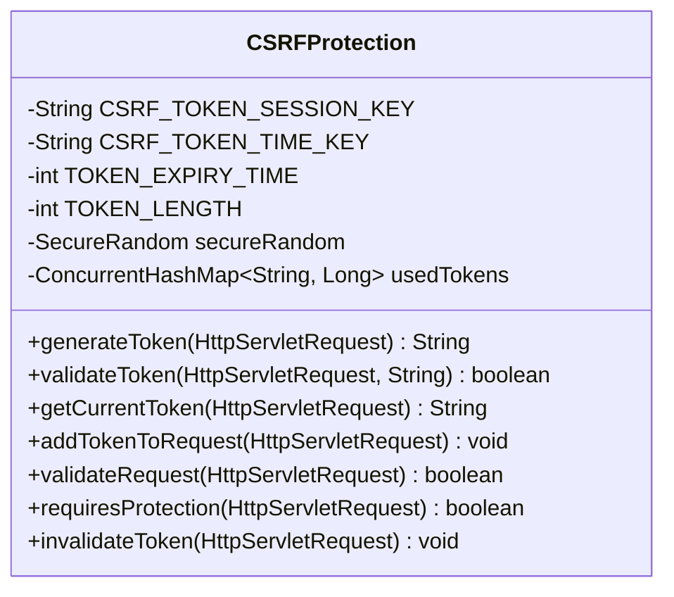
```mermaid
classDiagram
    class CSRFProtection {
        -String CSRF_TOKEN_SESSION_KEY
        -String CSRF_TOKEN_TIME_KEY
        -int TOKEN_EXPIRY_TIME
        -int TOKEN_LENGTH
        -SecureRandom secureRandom
        -ConcurrentHashMap~String, Long~ usedTokens
        +generateToken(HttpServletRequest) String
        +validateToken(HttpServletRequest, String) boolean
        +getCurrentToken(HttpServletRequest) String
        +addTokenToRequest(HttpServletRequest) void
        +validateRequest(HttpServletRequest) boolean
        +requiresProtection(HttpServletRequest) boolean
        +invalidateToken(HttpServletRequest) void
    }
```

### RateLimiter

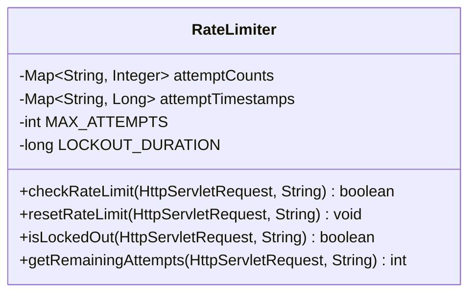
```mermaid
classDiagram
    class RateLimiter {
        -Map~String, Integer~ attemptCounts
        -Map~String, Long~ attemptTimestamps
        -int MAX_ATTEMPTS
        -long LOCKOUT_DURATION
        +checkRateLimit(HttpServletRequest, String) boolean
        +resetRateLimit(HttpServletRequest, String) void
        +isLockedOut(HttpServletRequest, String) boolean
        +getRemainingAttempts(HttpServletRequest, String) int
    }
```

## Utility Classes

### CacheService

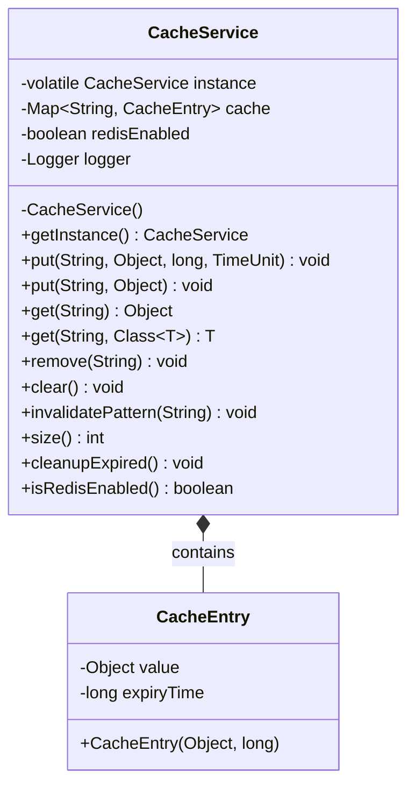
```mermaid
classDiagram
    class CacheService {
        -volatile CacheService instance
        -Map~String, CacheEntry~ cache
        -boolean redisEnabled
        -Logger logger
        -CacheService()
        +getInstance() CacheService
        +put(String, Object, long, TimeUnit) void
        +put(String, Object) void
        +get(String) Object
        +get(String, Class~T~) T
        +remove(String) void
        +clear() void
        +invalidatePattern(String) void
        +size() int
        +cleanupExpired() void
        +isRedisEnabled() boolean
    }
    
    class CacheEntry {
        -Object value
        -long expiryTime
        +CacheEntry(Object, long)
    }
    
    CacheService *-- CacheEntry : contains
```

### DBConnection

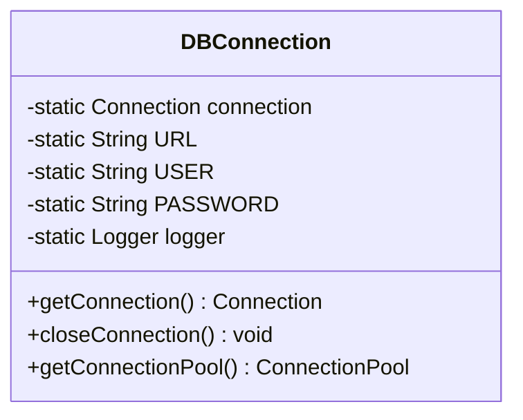
```mermaid
classDiagram
    class DBConnection {
        -static Connection connection
        -static String URL
        -static String USER
        -static String PASSWORD
        -static Logger logger
        +getConnection() Connection
        +closeConnection() void
        +getConnectionPool() ConnectionPool
    }
```

### Validator

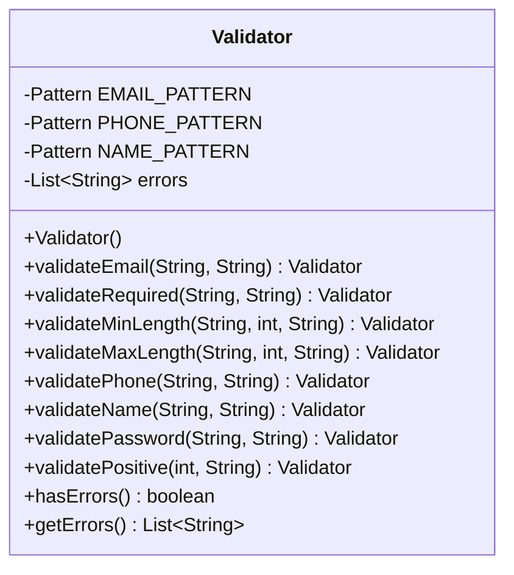
```mermaid
classDiagram
    class Validator {
        -Pattern EMAIL_PATTERN
        -Pattern PHONE_PATTERN
        -Pattern NAME_PATTERN
        -List~String~ errors
        +Validator()
        +validateEmail(String, String) Validator
        +validateRequired(String, String) Validator
        +validateMinLength(String, int, String) Validator
        +validateMaxLength(String, int, String) Validator
        +validatePhone(String, String) Validator
        +validateName(String, String) Validator
        +validatePassword(String, String) Validator
        +validatePositive(int, String) Validator
        +hasErrors() boolean
        +getErrors() List~String~
    }
```

## Filter Classes

### AuthFilter

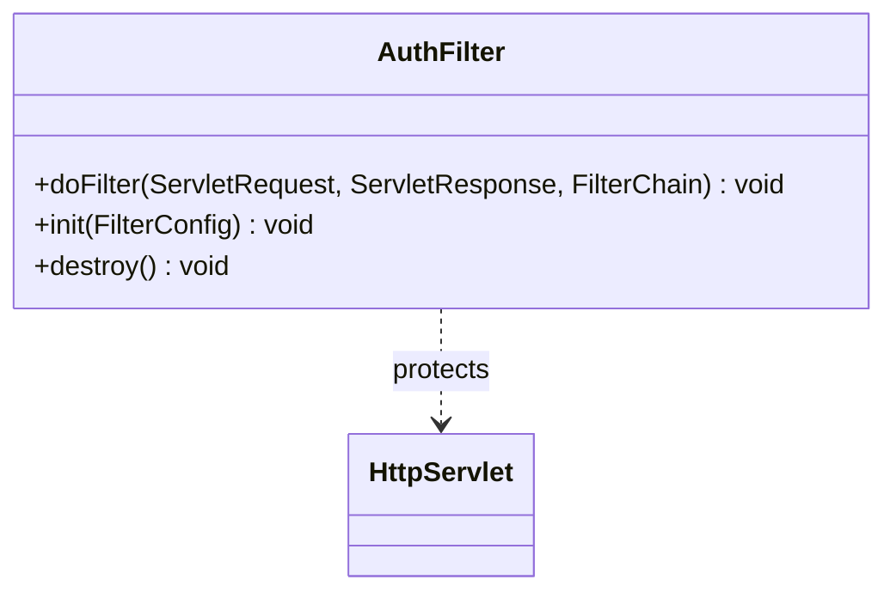
```mermaid
classDiagram
    class AuthFilter {
        +doFilter(ServletRequest, ServletResponse, FilterChain) void
        +init(FilterConfig) void
        +destroy() void
    }
    
    AuthFilter ..> HttpServlet : protects
```

### SecurityFilter

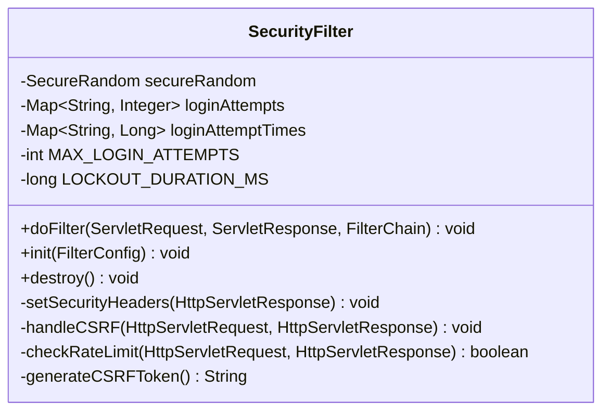
```mermaid
classDiagram
    class SecurityFilter {
        -SecureRandom secureRandom
        -Map~String, Integer~ loginAttempts
        -Map~String, Long~ loginAttemptTimes
        -int MAX_LOGIN_ATTEMPTS
        -long LOCKOUT_DURATION_MS
        +doFilter(ServletRequest, ServletResponse, FilterChain) void
        +init(FilterConfig) void
        +destroy() void
        -setSecurityHeaders(HttpServletResponse) void
        -handleCSRF(HttpServletRequest, HttpServletResponse) void
        -checkRateLimit(HttpServletRequest, HttpServletResponse) boolean
        -generateCSRFToken() String
    }
```

## Entity Relationships

### User-Order Relationship

```mermaid
classDiagram
    User "1" --> "many" Order : places
    Order "many" --> "1" User : belongs to
    Order "1" --> "many" OrderItem : contains
    OrderItem "many" --> "1" Order : part of
    OrderItem "many" --> "1" Product : references
```

### Product-Size Relationship

```mermaid
classDiagram
    Product "1" --> "many" ProductSize : has
    ProductSize "many" --> "1" Product : belongs to
    Product "many" --> "many" CartItem : in
    Product "many" --> "many" OrderItem : in
    Product "many" --> "many" WishlistItem : in
    Product "many" --> "many" Review : has
```

### User-Cart Relationship

```mermaid
classDiagram
    User "1" --> "many" CartItem : has
    CartItem "many" --> "1" User : owned by
    CartItem "many" --> "1" Product : references
```

### User-Wishlist Relationship

```mermaid
classDiagram
    User "1" --> "many" WishlistItem : has
    WishlistItem "many" --> "1" User : owned by
    WishlistItem "many" --> "1" Product : references
```

### Product-Category Relationship

```mermaid
classDiagram
    Category "1" --> "many" Product : contains
    Product "many" --> "1" Category : belongs to
```
