# FashionStore Sequence Diagrams

## User Registration Flow

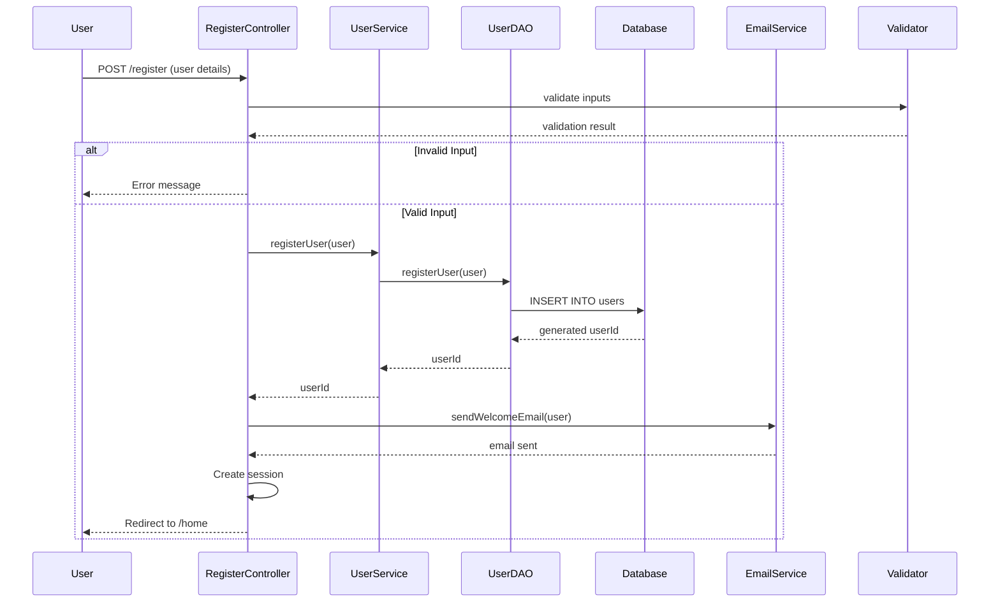

## User Login Flow

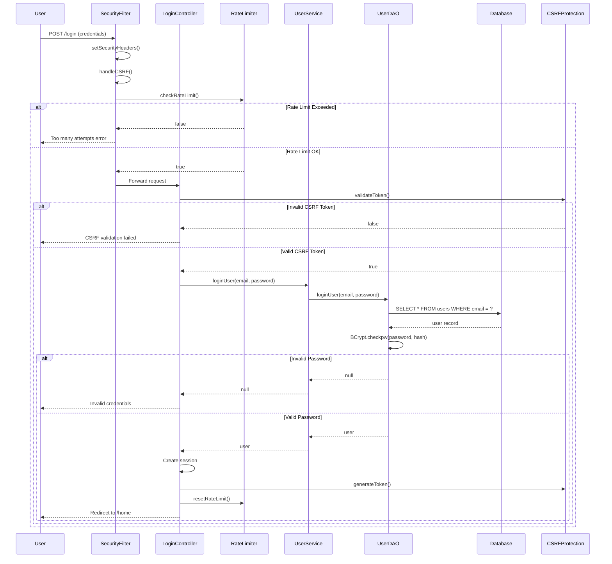

## Product Browsing Flow

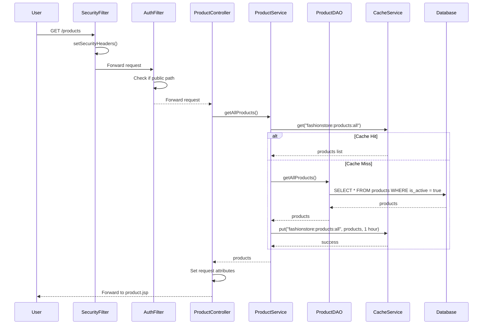

## Product Details Flow

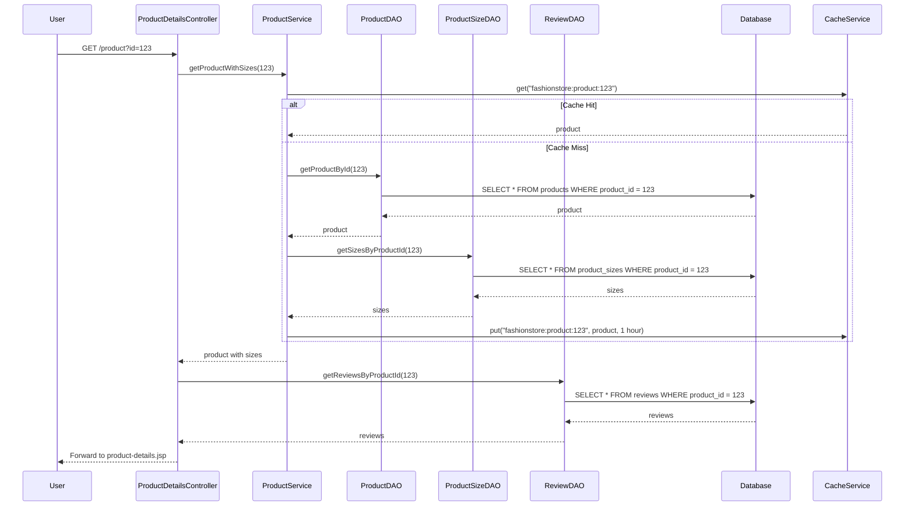

## Add to Cart Flow

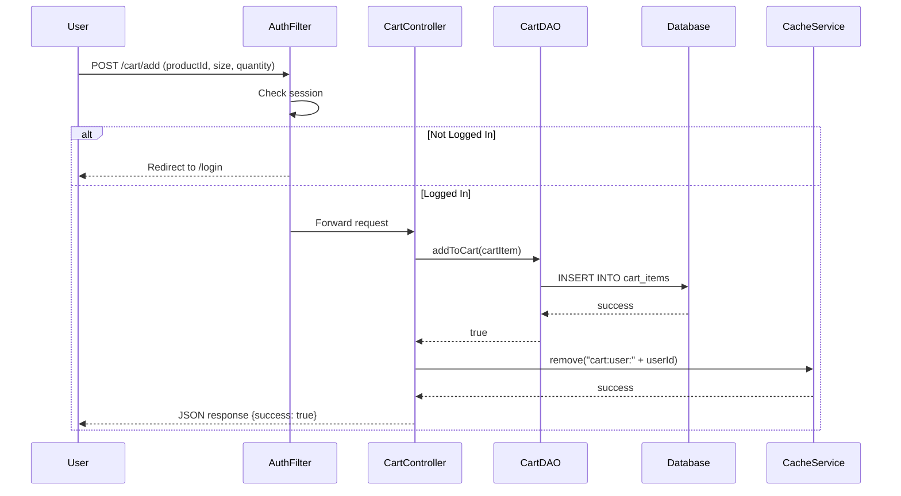

## Checkout Flow

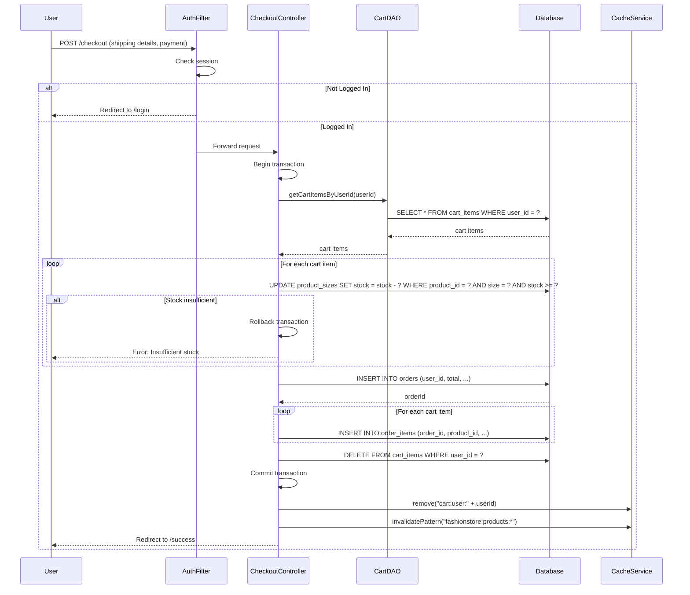

## Order History Flow

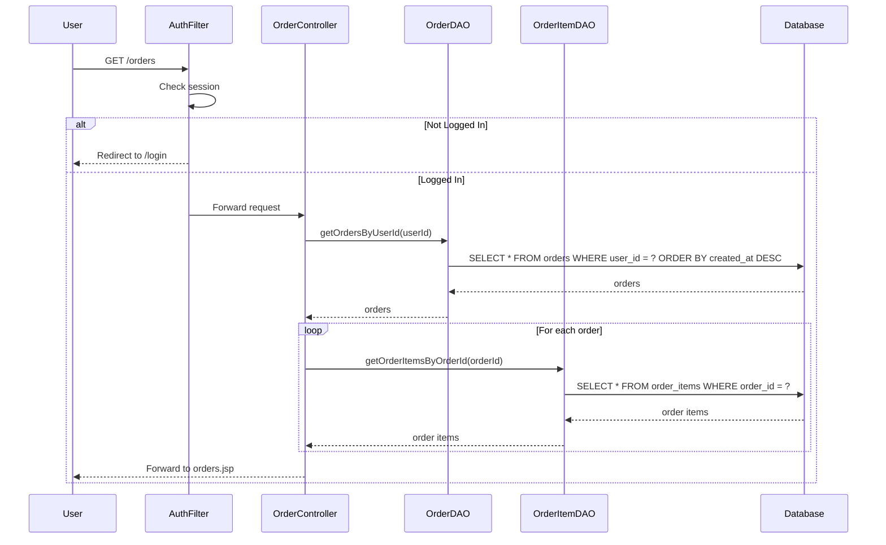

## Search Flow

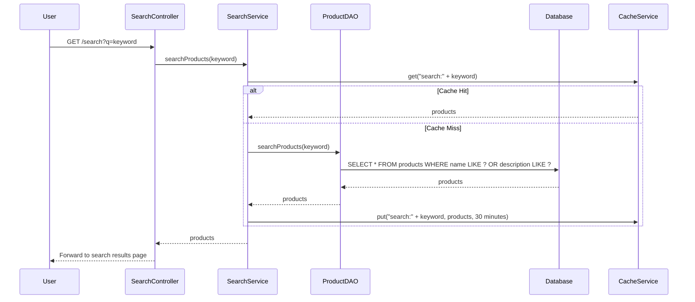

## Wishlist Flow

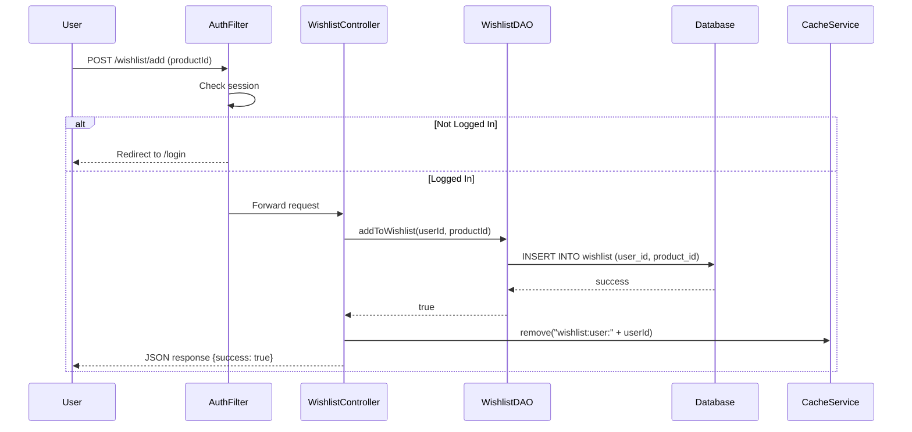

## Admin Product Management Flow

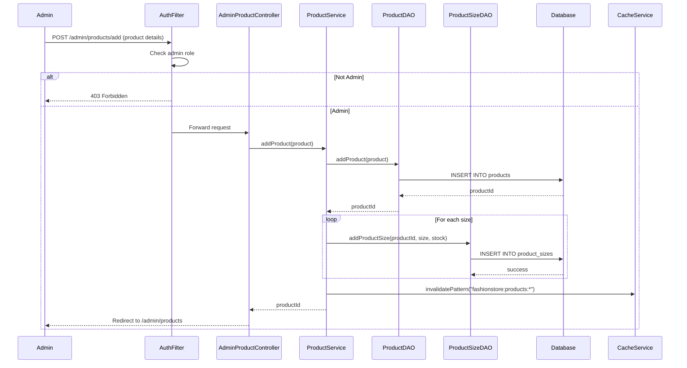

## Payment Flow

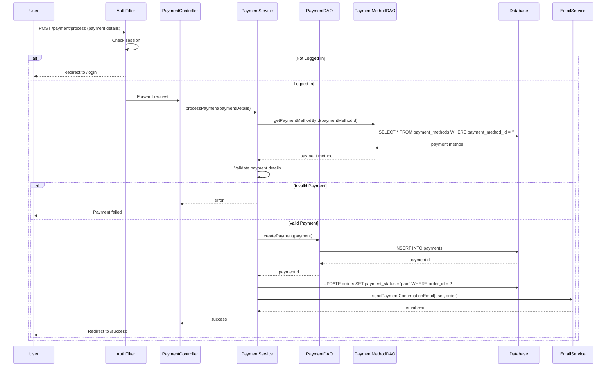

## Cache Invalidation Flow

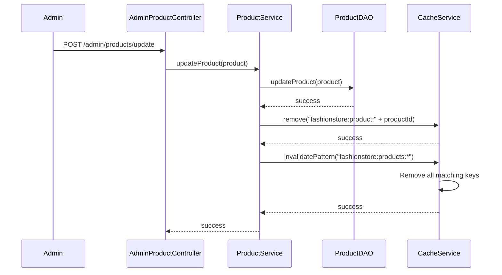

## Password Reset Flow

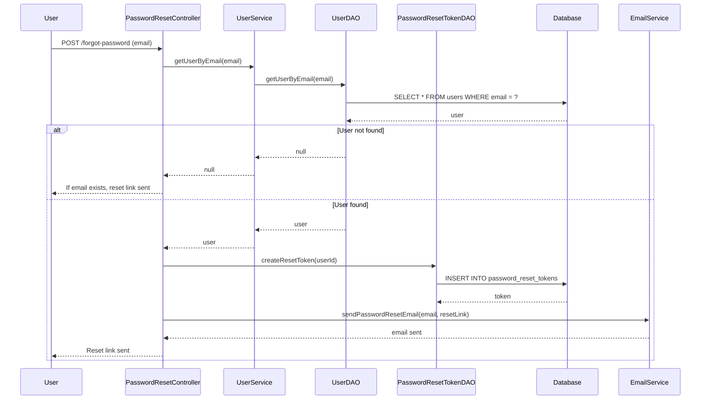

## Review Submission Flow

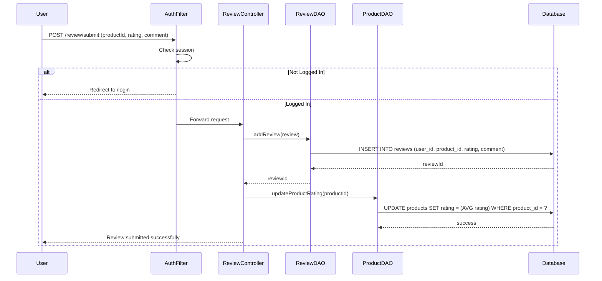
