# FashionStore Database Schema Documentation

## Database Overview

**Database Name:** fashionstore  
**Engine:** InnoDB  
**Character Set:** utf8mb4  
**Collation:** utf8mb4_general_ci  

## Entity-Relationship Diagram

```mermaid
erDiagram
    USERS ||--o{ CART_ITEMS : has
    USERS ||--o{ WISHLIST_ITEMS : has
    USERS ||--o{ SAVED_ITEMS : has
    USERS ||--o{ ORDERS : places
    USERS ||--o{ REVIEWS : writes
    USERS ||--o{ PAYMENT_METHODS : owns
    USERS ||--o{ ADDRESSES : has
    USERS ||--o{ PASSWORD_RESET_TOKENS : has
    USERS ||--o{ SEARCH_HISTORY : performs
    USERS ||--o{ RECENTLY_VIEWED : views
    USERS ||--o{ COUPON_USAGE : uses
    
    CATEGORIES ||--o{ PRODUCTS : contains
    PRODUCTS ||--o{ PRODUCT_SIZES : has
    PRODUCTS ||--o{ CART_ITEMS : in
    PRODUCTS ||--o{ WISHLIST_ITEMS : in
    PRODUCTS ||--o{ SAVED_ITEMS : in
    PRODUCTS ||--o{ ORDER_ITEMS : in
    PRODUCTS ||--o{ REVIEWS : has
    PRODUCTS ||--o{ PRODUCT_ATTRIBUTES : has
    PRODUCTS ||--o{ PRODUCT_RECOMMENDATIONS : has
    PRODUCTS ||--o{ SEARCH_HISTORY : matches
    PRODUCTS ||--o{ RECENTLY_VIEWED : viewed
    
    ORDERS ||--o{ ORDER_ITEMS : contains
    ORDERS ||--o{ PAYMENTS : has
    ORDERS ||--o{ ORDER_STATUS_HISTORY : tracks
    ORDERS ||--o{ PAYMENT_TRANSACTIONS : has
    ORDERS ||--o{ REFUNDS : has
    ORDERS ||--o{ INVOICES : has
    ORDERS ||--o{ COUPON_USAGE : uses
    ORDERS }o--|| ADDRESSES : billing
    ORDERS }o--|| ADDRESSES : shipping
    
    COUPONS ||--o{ COUPON_USAGE : used_in
    PAYMENT_METHODS ||--o{ PAYMENT_TRANSACTIONS : used_in
    
    CATEGORIES ||--o{ CATEGORIES : parent_of
```



## Core Tables

### 1. USERS

**Purpose:** Stores user account information with role-based access control  
**Java Class:** `User.java`  
**DAO Interface:** `UserDAO.java`  
**DAO Implementation:** `UserDAOImpl.java`

| Column | Type | Constraints | Description |
|--------|------|-------------|-------------|
| user_id | INT | PRIMARY KEY, AUTO_INCREMENT | Unique user identifier |
| full_name | VARCHAR(100) | NOT NULL | User's full name |
| email | VARCHAR(100) | UNIQUE, NOT NULL | User's email address (login) |
| phone | VARCHAR(15) | NULL | Contact phone number |
| password | VARCHAR(255) | NOT NULL | BCrypt hashed password |
| gender | VARCHAR(10) | NULL | User's gender |
| address | TEXT | NULL | User's address |
| role | VARCHAR(20) | DEFAULT 'customer' | User role (customer/admin) |
| is_active | BOOLEAN | DEFAULT TRUE | Account active status |
| created_at | TIMESTAMP | DEFAULT CURRENT_TIMESTAMP | Account creation timestamp |
| updated_at | TIMESTAMP | DEFAULT CURRENT_TIMESTAMP ON UPDATE | Last update timestamp |

**Indexes:**
- PRIMARY KEY on user_id
- UNIQUE KEY on email (idx_user_email)

**Relationships:**
- One-to-Many with CART_ITEMS
- One-to-Many with WISHLIST_ITEMS
- One-to-Many with SAVED_ITEMS
- One-to-Many with ORDERS
- One-to-Many with REVIEWS
- One-to-Many with PAYMENT_METHODS
- One-to-Many with ADDRESSES
- One-to-Many with PASSWORD_RESET_TOKENS

---

### 2. CATEGORIES

**Purpose:** Product categorization with hierarchical structure  
**Java Class:** `Category.java`  
**DAO Interface:** `CategoryDAO.java`  
**DAO Implementation:** `CategoryDAOImpl.java`

| Column | Type | Constraints | Description |
|--------|------|-------------|-------------|
| category_id | INT | PRIMARY KEY, AUTO_INCREMENT | Unique category identifier |
| category_name | VARCHAR(100) | NOT NULL, UNIQUE | Category name |
| description | TEXT | NULL | Category description |
| parent_category_id | INT | NULL, FOREIGN KEY | Parent category for hierarchy |
| is_active | BOOLEAN | DEFAULT TRUE | Category active status |
| created_at | TIMESTAMP | DEFAULT CURRENT_TIMESTAMP | Creation timestamp |

**Indexes:**
- PRIMARY KEY on category_id
- UNIQUE KEY on category_name
- FOREIGN KEY on parent_category_id (self-reference)

**Relationships:**
- One-to-Many with PRODUCTS
- Self-reference for parent-child hierarchy

---

### 3. PRODUCTS

**Purpose:** Product catalog with inventory tracking  
**Java Class:** `Product.java`  
**DAO Interface:** `ProductDAO.java`  
**DAO Implementation:** `ProductDAOImpl.java`

| Column | Type | Constraints | Description |
|--------|------|-------------|-------------|
| product_id | INT | PRIMARY KEY, AUTO_INCREMENT | Unique product identifier |
| product_name | VARCHAR(255) | NOT NULL | Product name |
| description | TEXT | NULL | Product description |
| price | DECIMAL(10,2) | NOT NULL, CHECK (>=0) | Product price |
| discount_percent | DECIMAL(5,2) | DEFAULT 0, CHECK (0-100) | Discount percentage |
| image_url | VARCHAR(255) | NULL | Product image URL |
| active | BOOLEAN | DEFAULT TRUE | Product active status |
| is_new | BOOLEAN | DEFAULT FALSE | New arrival flag |
| is_sale | BOOLEAN | DEFAULT FALSE | Sale flag |
| is_trending | BOOLEAN | DEFAULT FALSE | Trending flag |
| brand | VARCHAR(100) | NULL | Product brand |
| stock_quantity | INT | DEFAULT 0, CHECK (>=0) | Total stock quantity |
| category_id | INT | NOT NULL, FOREIGN KEY | Product category |
| popular_score | DECIMAL(5,2) | DEFAULT 0.00 | Popularity score for recommendations |
| created_at | TIMESTAMP | DEFAULT CURRENT_TIMESTAMP | Creation timestamp |
| updated_at | TIMESTAMP | DEFAULT CURRENT_TIMESTAMP ON UPDATE | Last update timestamp |

**Indexes:**
- PRIMARY KEY on product_id
- FOREIGN KEY on category_id
- INDEX on category_id, active, price
- INDEX on product_name
- INDEX on brand
- INDEX on active
- INDEX on category_id
- INDEX on is_new
- INDEX on is_sale
- INDEX on is_trending
- INDEX on active, stock_quantity
- INDEX on price, active
- INDEX on created_at DESC, active
- FULLTEXT INDEX on product_name
- FULLTEXT INDEX on description
- FULLTEXT INDEX on product_name, description, brand

**Relationships:**
- Many-to-One with CATEGORIES
- One-to-Many with PRODUCT_SIZES
- One-to-Many with CART_ITEMS
- One-to-Many with WISHLIST_ITEMS
- One-to-Many with SAVED_ITEMS
- One-to-Many with ORDER_ITEMS
- One-to-Many with REVIEWS

---

### 4. PRODUCT_SIZES

**Purpose:** Product size variants with individual stock tracking  
**Java Class:** `ProductSize.java`  
**DAO Interface:** `ProductSizeDAO.java`  
**DAO Implementation:** `ProductSizeDAOImpl.java`

| Column | Type | Constraints | Description |
|--------|------|-------------|-------------|
| product_size_id | INT | PRIMARY KEY, AUTO_INCREMENT | Unique size identifier |
| product_id | INT | NOT NULL, FOREIGN KEY | Parent product |
| size_label | VARCHAR(20) | NOT NULL | Size label (S, M, L, XL, etc.) |
| stock_quantity | INT | DEFAULT 0 | Stock quantity for this size |
| sku_code | VARCHAR(50) | NULL | SKU code for inventory |
| is_available | BOOLEAN | DEFAULT TRUE | Availability status |
| created_at | TIMESTAMP | DEFAULT CURRENT_TIMESTAMP | Creation timestamp |

**Indexes:**
- PRIMARY KEY on product_size_id
- FOREIGN KEY on product_id (CASCADE DELETE)
- INDEX on product_id
- INDEX on size_label
- UNIQUE KEY on product_id, size_label

**Relationships:**
- Many-to-One with PRODUCTS

---

## Shopping Tables

### 5. CART_ITEMS

**Purpose:** User shopping cart items  
**Java Class:** `CartItem.java`  
**DAO Interface:** `CartDAO.java`  
**DAO Implementation:** `CartDAOImpl.java`

| Column | Type | Constraints | Description |
|--------|------|-------------|-------------|
| cart_item_id | INT | PRIMARY KEY, AUTO_INCREMENT | Unique cart item identifier |
| user_id | INT | NOT NULL, FOREIGN KEY | User who owns the cart |
| product_id | INT | NOT NULL, FOREIGN KEY | Product in cart |
| size_label | VARCHAR(10) | NULL | Selected size |
| quantity | INT | DEFAULT 1, CHECK (>0) | Item quantity |
| added_at | TIMESTAMP | DEFAULT CURRENT_TIMESTAMP | When item was added |

**Indexes:**
- PRIMARY KEY on cart_item_id
- FOREIGN KEY on user_id (CASCADE DELETE/UPDATE)
- FOREIGN KEY on product_id (CASCADE DELETE/UPDATE)
- UNIQUE KEY on user_id, product_id, size_label

**Relationships:**
- Many-to-One with USERS
- Many-to-One with PRODUCTS

---

### 6. WISHLIST_ITEMS

**Purpose:** User wishlist items  
**Java Class:** `WishlistItem.java`  
**DAO Interface:** `WishlistDAO.java`  
**DAO Implementation:** `WishlistDAOImpl.java`

| Column | Type | Constraints | Description |
|--------|------|-------------|-------------|
| wishlist_item_id | INT | PRIMARY KEY, AUTO_INCREMENT | Unique wishlist identifier |
| user_id | INT | NOT NULL, FOREIGN KEY | User who owns the wishlist |
| product_id | INT | NOT NULL, FOREIGN KEY | Product in wishlist |
| created_at | TIMESTAMP | DEFAULT CURRENT_TIMESTAMP | When item was added |

**Indexes:**
- PRIMARY KEY on wishlist_item_id
- FOREIGN KEY on user_id (CASCADE DELETE/UPDATE)
- FOREIGN KEY on product_id (CASCADE DELETE/UPDATE)
- UNIQUE KEY on user_id, product_id

**Relationships:**
- Many-to-One with USERS
- Many-to-One with PRODUCTS

---

### 7. SAVED_ITEMS

**Purpose:** Save for later items  
**Java Class:** `SavedItem.java`  
**DAO Interface:** `SavedItemDAO.java`  
**DAO Implementation:** `SavedItemDAOImpl.java`

| Column | Type | Constraints | Description |
|--------|------|-------------|-------------|
| saved_item_id | INT | PRIMARY KEY, AUTO_INCREMENT | Unique saved item identifier |
| user_id | INT | NOT NULL, FOREIGN KEY | User who saved the item |
| product_id | INT | NOT NULL, FOREIGN KEY | Product saved |
| size_label | VARCHAR(10) | NULL | Selected size |
| saved_at | TIMESTAMP | DEFAULT CURRENT_TIMESTAMP | When item was saved |

**Indexes:**
- PRIMARY KEY on saved_item_id
- FOREIGN KEY on user_id (CASCADE DELETE)
- FOREIGN KEY on product_id (CASCADE DELETE)
- UNIQUE KEY on user_id, product_id, size_label

**Relationships:**
- Many-to-One with USERS
- Many-to-One with PRODUCTS

---

## Order Tables

### 8. ADDRESSES

**Purpose:** User addresses for billing and shipping  
**Java Class:** `Address.java`  
**DAO Interface:** `AddressDAO.java`  
**DAO Implementation:** `AddressDAOImpl.java`

| Column | Type | Constraints | Description |
|--------|------|-------------|-------------|
| address_id | INT | PRIMARY KEY, AUTO_INCREMENT | Unique address identifier |
| user_id | INT | NOT NULL, FOREIGN KEY | User who owns the address |
| address_type | ENUM | DEFAULT 'both' | billing, shipping, or both |
| full_name | VARCHAR(255) | NOT NULL | Recipient name |
| phone | VARCHAR(20) | NOT NULL | Contact phone |
| address_line1 | VARCHAR(255) | NOT NULL | Address line 1 |
| address_line2 | VARCHAR(255) | NULL | Address line 2 |
| city | VARCHAR(100) | NOT NULL | City |
| state | VARCHAR(100) | NOT NULL | State |
| postal_code | VARCHAR(20) | NOT NULL | Postal code |
| country | VARCHAR(100) | DEFAULT 'India' | Country |
| is_default | BOOLEAN | DEFAULT FALSE | Default address flag |
| created_at | TIMESTAMP | DEFAULT CURRENT_TIMESTAMP | Creation timestamp |
| updated_at | TIMESTAMP | DEFAULT CURRENT_TIMESTAMP ON UPDATE | Last update timestamp |

**Indexes:**
- PRIMARY KEY on address_id
- FOREIGN KEY on user_id (CASCADE DELETE)
- INDEX on user_id
- INDEX on user_id, is_default

**Relationships:**
- Many-to-One with USERS
- One-to-Many with ORDERS (billing)
- One-to-Many with ORDERS (shipping)

---

### 9. ORDERS

**Purpose:** Customer orders with status tracking  
**Java Class:** `Order.java`  
**DAO Interface:** `OrderDAO.java`  
**DAO Implementation:** `OrderDAOImpl.java`

| Column | Type | Constraints | Description |
|--------|------|-------------|-------------|
| order_id | INT | PRIMARY KEY, AUTO_INCREMENT | Unique order identifier |
| user_id | INT | NULL, FOREIGN KEY | Customer who placed order |
| billing_address_id | INT | NULL, FOREIGN KEY | Billing address reference |
| shipping_address_id | INT | NULL, FOREIGN KEY | Shipping address reference |
| payment_method_id | INT | NULL, FOREIGN KEY | Payment method used |
| coupon_id | INT | NULL, FOREIGN KEY | Coupon applied |
| full_name | VARCHAR(100) | NULL | Customer name |
| address | TEXT | NULL | Shipping address |
| city | VARCHAR(50) | NULL | City |
| state | VARCHAR(50) | NULL | State |
| zip | VARCHAR(10) | NULL | ZIP code |
| phone | VARCHAR(15) | NULL | Contact phone |
| payment_method | VARCHAR(20) | NULL | Payment method type |
| status | VARCHAR(20) | DEFAULT 'PLACED' | Order status |
| shipping_status | VARCHAR(50) | DEFAULT 'PROCESSING' | Shipping status |
| tracking_number | VARCHAR(100) | NULL | Shipment tracking number |
| estimated_delivery | DATE | NULL | Estimated delivery date |
| actual_delivery | DATE | NULL | Actual delivery date |
| notes | TEXT | NULL | Order notes |
| subtotal | DECIMAL(10,2) | NOT NULL, DEFAULT 0.00 | Order subtotal |
| tax_amount | DECIMAL(10,2) | DEFAULT 0.00 | Tax amount |
| shipping_fee | DECIMAL(10,2) | DEFAULT 0.00 | Shipping fee |
| discount_amount | DECIMAL(10,2) | DEFAULT 0.00 | Discount amount |
| total_amount | DECIMAL(10,2) | NOT NULL | Order total |
| payment_status | ENUM | DEFAULT 'pending' | Payment status |
| payment_gateway | VARCHAR(50) | NULL | Payment gateway used |
| transaction_id | VARCHAR(255) | NULL | Transaction ID |
| created_at | TIMESTAMP | DEFAULT CURRENT_TIMESTAMP | Order creation timestamp |
| updated_at | TIMESTAMP | DEFAULT CURRENT_TIMESTAMP ON UPDATE | Last update timestamp |

**Indexes:**
- PRIMARY KEY on order_id
- FOREIGN KEY on user_id (RESTRICT DELETE)
- FOREIGN KEY on billing_address_id (SET NULL)
- FOREIGN KEY on shipping_address_id (SET NULL)
- INDEX on status, created_at DESC
- INDEX on user_id, created_at DESC

**Relationships:**
- Many-to-One with USERS
- Many-to-One with ADDRESSES (billing)
- Many-to-One with ADDRESSES (shipping)
- One-to-Many with ORDER_ITEMS
- One-to-Many with PAYMENTS
- One-to-Many with ORDER_STATUS_HISTORY
- One-to-Many with PAYMENT_TRANSACTIONS
- One-to-Many with REFUNDS
- One-to-Many with INVOICES

---

### 10. ORDER_ITEMS

**Purpose:** Individual items within orders  
**Java Class:** `OrderItem.java`  
**DAO Interface:** `OrderItemDAO.java`  
**DAO Implementation:** `OrderItemDAOImpl.java`

| Column | Type | Constraints | Description |
|--------|------|-------------|-------------|
| order_item_id | INT | PRIMARY KEY, AUTO_INCREMENT | Unique order item identifier |
| order_id | INT | NOT NULL, FOREIGN KEY | Parent order |
| product_id | INT | NOT NULL, FOREIGN KEY | Product reference |
| size_label | VARCHAR(10) | NULL | Product size |
| quantity | INT | NOT NULL, CHECK (>0) | Item quantity |
| price | DECIMAL(10,2) | NOT NULL, CHECK (>=0) | Legacy unit price |
| unit_price | DECIMAL(10,2) | NOT NULL, CHECK (>=0) | Unit price at purchase |
| total_price | DECIMAL(10,2) | NOT NULL | Total price (unit_price * quantity) |
| created_at | TIMESTAMP | DEFAULT CURRENT_TIMESTAMP | Creation timestamp |

**Indexes:**
- PRIMARY KEY on order_item_id
- FOREIGN KEY on order_id (CASCADE DELETE/UPDATE)
- FOREIGN KEY on product_id (RESTRICT DELETE/UPDATE)

**Relationships:**
- Many-to-One with ORDERS
- Many-to-One with PRODUCTS

---

### 11. ORDER_STATUS_HISTORY

**Purpose:** Track order status changes  
**Java Class:** `OrderStatus.java`  
**DAO Interface:** None (managed by OrderDAO)

| Column | Type | Constraints | Description |
|--------|------|-------------|-------------|
| history_id | INT | PRIMARY KEY, AUTO_INCREMENT | Unique history identifier |
| order_id | INT | NOT NULL, FOREIGN KEY | Order reference |
| old_status | VARCHAR(50) | NULL | Previous status |
| new_status | VARCHAR(50) | NOT NULL | New status |
| changed_by | VARCHAR(100) | NULL | Who changed status |
| changed_at | TIMESTAMP | DEFAULT CURRENT_TIMESTAMP | When status changed |
| notes | TEXT | NULL | Change notes |

**Indexes:**
- PRIMARY KEY on history_id
- FOREIGN KEY on order_id (CASCADE DELETE)
- INDEX on order_id
- INDEX on changed_at

**Relationships:**
- Many-to-One with ORDERS

---

## Payment Tables

### 12. PAYMENTS

**Purpose:** Payment transaction records  
**Java Class:** `Payment.java`  
**DAO Interface:** `PaymentDAO.java`  
**DAO Implementation:** `PaymentDAOImpl.java`

| Column | Type | Constraints | Description |
|--------|------|-------------|-------------|
| payment_id | INT | PRIMARY KEY, AUTO_INCREMENT | Unique payment identifier |
| order_id | INT | NOT NULL, FOREIGN KEY | Associated order |
| payment_method | VARCHAR(50) | NOT NULL | Payment method type |
| transaction_id | VARCHAR(255) | NOT NULL | Transaction ID |
| amount | DECIMAL(10,2) | NOT NULL | Payment amount |
| currency | VARCHAR(3) | DEFAULT 'INR' | Currency code |
| status | VARCHAR(50) | DEFAULT 'PENDING' | Payment status |
| gateway_response | TEXT | NULL | Gateway response data |
| payment_signature | VARCHAR(255) | NULL | Payment signature |
| webhook_id | VARCHAR(255) | NULL | Webhook ID |
| verified | BOOLEAN | DEFAULT FALSE | Verification status |
| created_at | TIMESTAMP | DEFAULT CURRENT_TIMESTAMP | Creation timestamp |
| updated_at | TIMESTAMP | DEFAULT CURRENT_TIMESTAMP ON UPDATE | Last update timestamp |

**Indexes:**
- PRIMARY KEY on payment_id
- FOREIGN KEY on order_id (CASCADE DELETE)
- INDEX on order_id
- INDEX on transaction_id
- INDEX on status
- INDEX on verified

**Relationships:**
- Many-to-One with ORDERS

---

### 13. PAYMENT_METHODS

**Purpose:** User saved payment methods  
**Java Class:** `PaymentMethod.java`  
**DAO Interface:** `PaymentMethodDAO.java`  
**DAO Implementation:** `PaymentMethodDAOImpl.java`

| Column | Type | Constraints | Description |
|--------|------|-------------|-------------|
| payment_method_id | INT | PRIMARY KEY, AUTO_INCREMENT | Unique payment method identifier |
| user_id | INT | NOT NULL, FOREIGN KEY | User who owns the method |
| method_type | ENUM | NOT NULL | credit_card, debit_card, upi, net_banking, wallet |
| provider | VARCHAR(50) | NOT NULL | Payment provider |
| method_alias | VARCHAR(100) | NULL | User-defined alias |
| last_four | VARCHAR(4) | NULL | Last 4 digits of card |
| expiry_month | INT | NULL | Expiry month |
| expiry_year | INT | NULL | Expiry year |
| card_brand | VARCHAR(50) | NULL | Card brand |
| is_default | BOOLEAN | DEFAULT FALSE | Default payment method |
| is_active | BOOLEAN | DEFAULT TRUE | Active status |
| gateway_token | VARCHAR(255) | NULL | Gateway token |
| created_at | TIMESTAMP | DEFAULT CURRENT_TIMESTAMP | Creation timestamp |
| updated_at | TIMESTAMP | DEFAULT CURRENT_TIMESTAMP ON UPDATE | Last update timestamp |

**Indexes:**
- PRIMARY KEY on payment_method_id
- FOREIGN KEY on user_id (CASCADE DELETE)
- INDEX on user_id
- INDEX on user_id, is_default

**Relationships:**
- Many-to-One with USERS
- One-to-Many with PAYMENT_TRANSACTIONS

---

### 14. PAYMENT_TRANSACTIONS

**Purpose:** Detailed payment transaction records  
**Java Class:** `PaymentTransaction.java`  
**DAO Interface:** None (managed by PaymentDAO)

| Column | Type | Constraints | Description |
|--------|------|-------------|-------------|
| transaction_id | INT | PRIMARY KEY, AUTO_INCREMENT | Unique transaction identifier |
| order_id | INT | NOT NULL, FOREIGN KEY | Associated order |
| payment_method_id | INT | NULL, FOREIGN KEY | Payment method used |
| gateway_transaction_id | VARCHAR(255) | NOT NULL | Gateway transaction ID |
| gateway | VARCHAR(50) | NOT NULL | Payment gateway |
| amount | DECIMAL(10,2) | NOT NULL | Transaction amount |
| currency | VARCHAR(3) | DEFAULT 'INR' | Currency code |
| status | ENUM | NOT NULL | pending, processing, completed, failed, cancelled, refunded |
| payment_method_type | VARCHAR(50) | NULL | Payment method type |
| gateway_response | TEXT | NULL | Gateway response |
| failure_reason | TEXT | NULL | Failure reason |
| created_at | TIMESTAMP | DEFAULT CURRENT_TIMESTAMP | Creation timestamp |
| updated_at | TIMESTAMP | DEFAULT CURRENT_TIMESTAMP ON UPDATE | Last update timestamp |

**Indexes:**
- PRIMARY KEY on transaction_id
- FOREIGN KEY on order_id (CASCADE DELETE)
- FOREIGN KEY on payment_method_id (SET NULL)
- INDEX on order_id
- INDEX on gateway, status
- INDEX on created_at

**Relationships:**
- Many-to-One with ORDERS
- Many-to-One with PAYMENT_METHODS

---

### 15. PASSWORD_RESET_TOKENS

**Purpose:** Password reset tokens for security  
**Java Class:** `PasswordResetToken.java`  
**DAO Interface:** `PasswordResetTokenDAO.java`  
**DAO Implementation:** `PasswordResetTokenDAOImpl.java`

| Column | Type | Constraints | Description |
|--------|------|-------------|-------------|
| token_id | INT | PRIMARY KEY, AUTO_INCREMENT | Unique token identifier |
| user_id | INT | NOT NULL, FOREIGN KEY | User requesting reset |
| token | VARCHAR(255) | NOT NULL, UNIQUE | Reset token |
| expires_at | TIMESTAMP | NOT NULL | Token expiration |
| used | BOOLEAN | DEFAULT FALSE | Token used status |
| created_at | TIMESTAMP | DEFAULT CURRENT_TIMESTAMP | Creation timestamp |

**Indexes:**
- PRIMARY KEY on token_id
- FOREIGN KEY on user_id (CASCADE DELETE)
- INDEX on token
- INDEX on user_id
- INDEX on expires_at

**Relationships:**
- Many-to-One with USERS

---

## Coupon & Discount Tables

### 16. COUPONS

**Purpose:** Discount coupons and promotions  
**Java Class:** `Coupon.java`  
**DAO Interface:** `CouponDAO.java`  
**DAO Implementation:** `CouponDAOImpl.java`

| Column | Type | Constraints | Description |
|--------|------|-------------|-------------|
| coupon_id | INT | PRIMARY KEY, AUTO_INCREMENT | Unique coupon identifier |
| code | VARCHAR(50) | UNIQUE, NOT NULL | Coupon code |
| description | TEXT | NULL | Coupon description |
| discount_type | ENUM | NOT NULL | PERCENTAGE or FIXED_AMOUNT |
| discount_value | DECIMAL(10,2) | NOT NULL | Discount value |
| minimum_order_amount | DECIMAL(10,2) | DEFAULT 0 | Minimum order amount |
| maximum_discount_amount | DECIMAL(10,2) | NULL | Maximum discount cap |
| usage_limit | INT | NULL | Total usage limit |
| usage_count | INT | DEFAULT 0 | Current usage count |
| user_usage_limit | INT | DEFAULT 0 | Per-user limit |
| valid_from | TIMESTAMP | DEFAULT CURRENT_TIMESTAMP | Valid from date |
| valid_until | TIMESTAMP | NOT NULL | Valid until date |
| is_active | BOOLEAN | DEFAULT TRUE | Active status |
| created_at | TIMESTAMP | DEFAULT CURRENT_TIMESTAMP | Creation timestamp |
| updated_at | TIMESTAMP | DEFAULT CURRENT_TIMESTAMP ON UPDATE | Last update timestamp |

**Indexes:**
- PRIMARY KEY on coupon_id
- UNIQUE KEY on code
- INDEX on code
- INDEX on is_active, valid_from, valid_until

**Relationships:**
- One-to-Many with COUPON_USAGE

---

### 17. COUPON_USAGE

**Purpose:** Track coupon usage by users  
**Java Class:** None (managed by CouponDAO)

| Column | Type | Constraints | Description |
|--------|------|-------------|-------------|
| coupon_usage_id | INT | PRIMARY KEY, AUTO_INCREMENT | Unique usage identifier |
| coupon_id | INT | NOT NULL, FOREIGN KEY | Coupon used |
| user_id | INT | NOT NULL, FOREIGN KEY | User who used coupon |
| order_id | INT | NOT NULL, FOREIGN KEY | Order where coupon was used |
| used_at | TIMESTAMP | DEFAULT CURRENT_TIMESTAMP | When coupon was used |

**Indexes:**
- PRIMARY KEY on coupon_usage_id
- FOREIGN KEY on coupon_id (CASCADE DELETE)
- FOREIGN KEY on user_id (CASCADE DELETE)
- FOREIGN KEY on order_id (CASCADE DELETE)
- UNIQUE KEY on coupon_id, user_id, order_id

**Relationships:**
- Many-to-One with COUPONS
- Many-to-One with USERS
- Many-to-One with ORDERS

---

## Reviews & Ratings

### 18. REVIEWS

**Purpose:** Product reviews and ratings  
**Java Class:** `Review.java`  
**DAO Interface:** `ReviewDAO.java`  
**DAO Implementation:** `ReviewDAOImpl.java`

| Column | Type | Constraints | Description |
|--------|------|-------------|-------------|
| review_id | INT | PRIMARY KEY, AUTO_INCREMENT | Unique review identifier |
| user_id | INT | NULL, FOREIGN KEY | User who wrote review |
| product_id | INT | NULL, FOREIGN KEY | Product being reviewed |
| rating | INT | CHECK (1-5) | Rating (1-5 stars) |
| comment | TEXT | NULL | Review comment |
| created_at | TIMESTAMP | DEFAULT CURRENT_TIMESTAMP | Review creation timestamp |

**Indexes:**
- PRIMARY KEY on review_id
- FOREIGN KEY on user_id (CASCADE DELETE/UPDATE)
- FOREIGN KEY on product_id (CASCADE DELETE/UPDATE)

**Relationships:**
- Many-to-One with USERS
- Many-to-One with PRODUCTS

---

## Search & Analytics Tables

### 19. SEARCH_HISTORY

**Purpose:** Track user search queries  
**Java Class:** None (managed by SearchService)

| Column | Type | Constraints | Description |
|--------|------|-------------|-------------|
| search_history_id | INT | PRIMARY KEY, AUTO_INCREMENT | Unique search identifier |
| user_id | INT | NULL, FOREIGN KEY | User who performed search |
| search_query | VARCHAR(255) | NOT NULL | Search query text |
| search_type | VARCHAR(50) | DEFAULT 'KEYWORD' | Search type |
| filters_applied | TEXT | NULL | Applied filters |
| results_count | INT | DEFAULT 0 | Number of results |
| clicked_product_id | INT | NULL, FOREIGN KEY | Product clicked |
| created_at | TIMESTAMP | DEFAULT CURRENT_TIMESTAMP | Search timestamp |

**Indexes:**
- PRIMARY KEY on search_history_id
- FOREIGN KEY on user_id (SET NULL)
- FOREIGN KEY on clicked_product_id (SET NULL)
- INDEX on user_id
- INDEX on search_query
- INDEX on created_at

**Relationships:**
- Many-to-One with USERS
- Many-to-One with PRODUCTS

---

### 20. RECENTLY_VIEWED

**Purpose:** Track recently viewed products  
**Java Class:** None (managed by RecommendationService)

| Column | Type | Constraints | Description |
|--------|------|-------------|-------------|
| recently_viewed_id | INT | PRIMARY KEY, AUTO_INCREMENT | Unique view identifier |
| user_id | INT | NOT NULL, FOREIGN KEY | User who viewed product |
| product_id | INT | NOT NULL, FOREIGN KEY | Product viewed |
| viewed_at | TIMESTAMP | DEFAULT CURRENT_TIMESTAMP | View timestamp |

**Indexes:**
- PRIMARY KEY on recently_viewed_id
- FOREIGN KEY on user_id (CASCADE DELETE)
- FOREIGN KEY on product_id (CASCADE DELETE)
- UNIQUE KEY on user_id, product_id
- INDEX on viewed_at

**Relationships:**
- Many-to-One with USERS
- Many-to-One with PRODUCTS

---

### 21. SEARCH_ANALYTICS

**Purpose:** Aggregate search analytics  
**Java Class:** None (managed by SearchService)

| Column | Type | Constraints | Description |
|--------|------|-------------|-------------|
| analytics_id | INT | PRIMARY KEY, AUTO_INCREMENT | Unique analytics identifier |
| search_query | VARCHAR(255) | NOT NULL, UNIQUE | Search query |
| search_count | INT | DEFAULT 0 | Total search count |
| result_count_avg | DECIMAL(10,2) | DEFAULT 0.00 | Average result count |
| click_through_rate | DECIMAL(5,2) | DEFAULT 0.00 | Click-through rate |
| last_searched | TIMESTAMP | DEFAULT CURRENT_TIMESTAMP ON UPDATE | Last search timestamp |

**Indexes:**
- PRIMARY KEY on analytics_id
- UNIQUE KEY on search_query
- INDEX on search_count

---

### 22. PRODUCT_ATTRIBUTES

**Purpose:** Additional product attributes  
**Java Class:** None (managed by ProductDAO)

| Column | Type | Constraints | Description |
|--------|------|-------------|-------------|
| attribute_id | INT | PRIMARY KEY, AUTO_INCREMENT | Unique attribute identifier |
| product_id | INT | NOT NULL, FOREIGN KEY | Product reference |
| attribute_name | VARCHAR(50) | NOT NULL | Attribute name |
| attribute_value | VARCHAR(100) | NOT NULL | Attribute value |
| created_at | TIMESTAMP | DEFAULT CURRENT_TIMESTAMP | Creation timestamp |

**Indexes:**
- PRIMARY KEY on attribute_id
- FOREIGN KEY on product_id (CASCADE DELETE)
- INDEX on product_id
- INDEX on attribute_name, attribute_value

**Relationships:**
- Many-to-One with PRODUCTS

---

### 23. PRODUCT_RECOMMENDATIONS

**Purpose:** Product recommendation data  
**Java Class:** None (managed by RecommendationService)

| Column | Type | Constraints | Description |
|--------|------|-------------|-------------|
| recommendation_id | INT | PRIMARY KEY, AUTO_INCREMENT | Unique recommendation identifier |
| product_id | INT | NOT NULL, FOREIGN KEY | Source product |
| recommended_product_id | INT | NOT NULL, FOREIGN KEY | Recommended product |
| recommendation_type | VARCHAR(50) | NOT NULL | Recommendation type |
| score | DECIMAL(5,2) | DEFAULT 0.00 | Recommendation score |
| created_at | TIMESTAMP | DEFAULT CURRENT_TIMESTAMP | Creation timestamp |

**Indexes:**
- PRIMARY KEY on recommendation_id
- FOREIGN KEY on product_id (CASCADE DELETE)
- FOREIGN KEY on recommended_product_id (CASCADE DELETE)
- INDEX on product_id
- INDEX on recommendation_type
- INDEX on score

**Relationships:**
- Many-to-One with PRODUCTS (source)
- Many-to-One with PRODUCTS (recommended)

---

## Shipping & Tax Tables

### 24. SHIPPING_ZONES

**Purpose:** Shipping zones and rates  
**Java Class:** None (managed by OrderService)

| Column | Type | Constraints | Description |
|--------|------|-------------|-------------|
| zone_id | INT | PRIMARY KEY, AUTO_INCREMENT | Unique zone identifier |
| zone_name | VARCHAR(100) | NOT NULL | Zone name |
| countries | TEXT | NOT NULL | Countries in zone |
| base_fee | DECIMAL(10,2) | NOT NULL, DEFAULT 0.00 | Base shipping fee |
| free_shipping_threshold | DECIMAL(10,2) | NULL | Free shipping threshold |
| created_at | TIMESTAMP | DEFAULT CURRENT_TIMESTAMP | Creation timestamp |

**Indexes:**
- PRIMARY KEY on zone_id

---

### 25. SHIPPING_RATES

**Purpose:** Weight-based shipping rates  
**Java Class:** None (managed by OrderService)

| Column | Type | Constraints | Description |
|--------|------|-------------|-------------|
| rate_id | INT | PRIMARY KEY, AUTO_INCREMENT | Unique rate identifier |
| zone_id | INT | NOT NULL, FOREIGN KEY | Shipping zone |
| weight_min | DECIMAL(8,2) | DEFAULT 0.00 | Minimum weight |
| weight_max | DECIMAL(8,2) | NULL | Maximum weight |
| rate | DECIMAL(10,2) | NOT NULL | Shipping rate |
| created_at | TIMESTAMP | DEFAULT CURRENT_TIMESTAMP | Creation timestamp |

**Indexes:**
- PRIMARY KEY on rate_id
- FOREIGN KEY on zone_id (CASCADE DELETE)
- INDEX on zone_id, weight_min

**Relationships:**
- Many-to-One with SHIPPING_ZONES

---

### 26. TAX_RATES

**Purpose:** Regional tax rates  
**Java Class:** None (managed by OrderService)

| Column | Type | Constraints | Description |
|--------|------|-------------|-------------|
| tax_id | INT | PRIMARY KEY, AUTO_INCREMENT | Unique tax identifier |
| country | VARCHAR(100) | NOT NULL | Country |
| state | VARCHAR(100) | NULL | State |
| city | VARCHAR(100) | NULL | City |
| postal_code_prefix | VARCHAR(10) | NULL | Postal code prefix |
| tax_rate | DECIMAL(5,4) | NOT NULL | Tax rate |
| tax_name | VARCHAR(100) | NOT NULL | Tax name |
| is_active | BOOLEAN | DEFAULT TRUE | Active status |
| created_at | TIMESTAMP | DEFAULT CURRENT_TIMESTAMP | Creation timestamp |
| updated_at | TIMESTAMP | DEFAULT CURRENT_TIMESTAMP ON UPDATE | Last update timestamp |

**Indexes:**
- PRIMARY KEY on tax_id
- INDEX on country, state, city
- INDEX on is_active

---

## Audit & Log Tables

### 27. EMAIL_LOGS

**Purpose:** Email sending logs  
**Java Class:** None (managed by EmailService)

| Column | Type | Constraints | Description |
|--------|------|-------------|-------------|
| email_log_id | INT | PRIMARY KEY, AUTO_INCREMENT | Unique log identifier |
| user_id | INT | NULL, FOREIGN KEY | User recipient |
| email_type | VARCHAR(50) | NOT NULL | Email type |
| recipient_email | VARCHAR(255) | NOT NULL | Recipient email |
| subject | VARCHAR(255) | NOT NULL | Email subject |
| status | VARCHAR(50) | DEFAULT 'PENDING' | Email status |
| error_message | TEXT | NULL | Error message |
| sent_at | TIMESTAMP | DEFAULT CURRENT_TIMESTAMP | Sent timestamp |

**Indexes:**
- PRIMARY KEY on email_log_id
- FOREIGN KEY on user_id (SET NULL)
- INDEX on user_id
- INDEX on email_type
- INDEX on status

**Relationships:**
- Many-to-One with USERS

---

### 28. EMAIL_NOTIFICATIONS

**Purpose:** Email notification queue  
**Java Class:** None (managed by EmailService)

| Column | Type | Constraints | Description |
|--------|------|-------------|-------------|
| notification_id | INT | PRIMARY KEY, AUTO_INCREMENT | Unique notification identifier |
| user_id | INT | NOT NULL, FOREIGN KEY | User recipient |
| order_id | INT | NULL, FOREIGN KEY | Related order |
| notification_type | ENUM | NOT NULL | Notification type |
| subject | VARCHAR(255) | NOT NULL | Email subject |
| content | TEXT | NOT NULL | Email content |
| recipient_email | VARCHAR(255) | NOT NULL | Recipient email |
| status | ENUM | DEFAULT 'pending' | Notification status |
| sent_at | TIMESTAMP | NULL | Sent timestamp |
| error_message | TEXT | NULL | Error message |
| created_at | TIMESTAMP | DEFAULT CURRENT_TIMESTAMP | Creation timestamp |

**Indexes:**
- PRIMARY KEY on notification_id
- FOREIGN KEY on user_id (CASCADE DELETE)
- FOREIGN KEY on order_id (SET NULL)
- INDEX on user_id
- INDEX on status
- INDEX on notification_type

**Relationships:**
- Many-to-One with USERS
- Many-to-One with ORDERS

---

## Refund & Invoice Tables

### 29. REFUNDS

**Purpose:** Refund requests and processing  
**Java Class:** None (managed by PaymentService)

| Column | Type | Constraints | Description |
|--------|------|-------------|-------------|
| refund_id | INT | PRIMARY KEY, AUTO_INCREMENT | Unique refund identifier |
| order_id | INT | NOT NULL, FOREIGN KEY | Related order |
| refund_amount | DECIMAL(10,2) | NOT NULL | Refund amount |
| refund_reason | VARCHAR(255) | NOT NULL | Refund reason |
| refund_type | ENUM | NOT NULL | full or partial |
| refund_status | ENUM | DEFAULT 'requested' | Refund status |
| refund_method | VARCHAR(50) | NULL | Refund method |
| gateway_refund_id | VARCHAR(255) | NULL | Gateway refund ID |
| admin_notes | TEXT | NULL | Admin notes |
| user_notes | TEXT | NULL | User notes |
| requested_at | TIMESTAMP | DEFAULT CURRENT_TIMESTAMP | Request timestamp |
| processed_at | TIMESTAMP | NULL | Process timestamp |

**Indexes:**
- PRIMARY KEY on refund_id
- FOREIGN KEY on order_id (CASCADE DELETE)
- INDEX on order_id
- INDEX on refund_status

**Relationships:**
- Many-to-One with ORDERS

---

### 30. INVOICES

**Purpose:** Order invoices  
**Java Class:** None (managed by OrderService)

| Column | Type | Constraints | Description |
|--------|------|-------------|-------------|
| invoice_id | INT | PRIMARY KEY, AUTO_INCREMENT | Unique invoice identifier |
| order_id | INT | NOT NULL, FOREIGN KEY | Related order |
| invoice_number | VARCHAR(50) | UNIQUE, NOT NULL | Invoice number |
| invoice_date | TIMESTAMP | DEFAULT CURRENT_TIMESTAMP | Invoice date |
| due_date | TIMESTAMP | NULL | Due date |
| subtotal | DECIMAL(10,2) | NOT NULL | Invoice subtotal |
| tax_amount | DECIMAL(10,2) | DEFAULT 0.00 | Tax amount |
| shipping_fee | DECIMAL(10,2) | DEFAULT 0.00 | Shipping fee |
| discount_amount | DECIMAL(10,2) | DEFAULT 0.00 | Discount amount |
| total_amount | DECIMAL(10,2) | NOT NULL | Invoice total |
| status | ENUM | DEFAULT 'draft' | Invoice status |
| pdf_path | VARCHAR(255) | NULL | PDF file path |
| sent_at | TIMESTAMP | NULL | Sent timestamp |
| paid_at | TIMESTAMP | NULL | Paid timestamp |

**Indexes:**
- PRIMARY KEY on invoice_id
- FOREIGN KEY on order_id (CASCADE DELETE)
- INDEX on order_id
- INDEX on invoice_number

**Relationships:**
- Many-to-One with ORDERS

---

## Database Views

### 1. v_trending_products
Returns top 50 trending products ordered by popular_score.

```sql
SELECT p.*
FROM products p
WHERE p.active = TRUE
ORDER BY p.popular_score DESC, p.created_at DESC
LIMIT 50;
```

### 2. v_low_stock_products
Returns products with low stock (≤10 items) with stock status classification.

```sql
SELECT
    p.product_id,
    p.product_name,
    p.stock_quantity,
    p.brand,
    p.price,
    CASE
        WHEN p.stock_quantity = 0 THEN 'OUT_OF_STOCK'
        WHEN p.stock_quantity <= 5 THEN 'CRITICAL'
        WHEN p.stock_quantity <= 10 THEN 'LOW'
        ELSE 'NORMAL'
    END as stock_status
FROM products p
WHERE p.active = TRUE AND p.stock_quantity <= 10
ORDER BY p.stock_quantity ASC;
```

### 3. v_pending_orders
Returns pending orders with time elapsed since placement.

```sql
SELECT
    o.order_id,
    o.user_id,
    u.full_name,
    o.total_amount,
    o.status,
    o.shipping_status,
    o.created_at as order_date,
    TIMESTAMPDIFF(HOUR, o.created_at, NOW()) as hours_pending
FROM orders o
JOIN users u ON o.user_id = u.user_id
WHERE o.status IN ('PENDING', 'PROCESSING')
ORDER BY o.created_at ASC;
```

### 4. v_daily_sales_summary
Returns daily sales summary with revenue and order metrics.

```sql
SELECT
    DATE(o.created_at) as sale_date,
    COUNT(*) as order_count,
    SUM(o.total_amount) as total_revenue,
    AVG(o.total_amount) as avg_order_value,
    COUNT(DISTINCT o.user_id) as unique_customers
FROM orders o
WHERE o.status = 'COMPLETED'
GROUP BY DATE(o.created_at)
ORDER BY sale_date DESC;
```

### 5. v_abandoned_carts
Returns abandoned carts (no activity for 24+ hours).

```sql
SELECT
    c.user_id,
    u.full_name,
    u.email,
    COUNT(*) as item_count,
    SUM(c.quantity * p.price) as cart_value,
    MAX(c.added_at) as last_activity
FROM cart_items c
JOIN users u ON c.user_id = u.user_id
JOIN products p ON c.product_id = p.product_id
WHERE c.added_at < DATE_SUB(NOW(), INTERVAL 24 HOUR)
GROUP BY c.user_id, u.full_name, u.email
HAVING item_count > 0
ORDER BY last_activity DESC;
```

## Database Triggers

### 1. trg_product_update_timestamp
Automatically updates the `updated_at` timestamp when a product is updated.

```sql
CREATE TRIGGER trg_product_update_timestamp
BEFORE UPDATE ON products
FOR EACH ROW
BEGIN
    SET NEW.updated_at = NOW();
END
```

### 2. trg_prevent_duplicate_pending_orders
Prevents duplicate pending orders within 5 minutes for the same user.

```sql
CREATE TRIGGER trg_prevent_duplicate_pending_orders
BEFORE INSERT ON orders
FOR EACH ROW
BEGIN
    DECLARE pending_count INT;
    SELECT COUNT(*) INTO pending_count
    FROM orders
    WHERE user_id = NEW.user_id
    AND status = 'PENDING'
    AND created_at > DATE_SUB(NOW(), INTERVAL 5 MINUTE);
    IF pending_count > 0 THEN
        SIGNAL SQLSTATE '45000'
        SET MESSAGE_TEXT = 'Another order is already being processed';
    END IF;
END
```

## ORM Mapping Summary

| Table | Java Class | DAO Interface | DAO Implementation |
|-------|-----------|---------------|-------------------|
| users | User.java | UserDAO.java | UserDAOImpl.java |
| categories | Category.java | CategoryDAO.java | CategoryDAOImpl.java |
| products | Product.java | ProductDAO.java | ProductDAOImpl.java |
| product_sizes | ProductSize.java | ProductSizeDAO.java | ProductSizeDAOImpl.java |
| cart_items | CartItem.java | CartDAO.java | CartDAOImpl.java |
| wishlist_items | WishlistItem.java | WishlistDAO.java | WishlistDAOImpl.java |
| saved_items | SavedItem.java | SavedItemDAO.java | SavedItemDAOImpl.java |
| addresses | Address.java | AddressDAO.java | AddressDAOImpl.java |
| orders | Order.java | OrderDAO.java | OrderDAOImpl.java |
| order_items | OrderItem.java | OrderItemDAO.java | OrderItemDAOImpl.java |
| payments | Payment.java | PaymentDAO.java | PaymentDAOImpl.java |
| payment_methods | PaymentMethod.java | PaymentMethodDAO.java | PaymentMethodDAOImpl.java |
| payment_transactions | PaymentTransaction.java | - | - (managed by PaymentDAO) |
| password_reset_tokens | PasswordResetToken.java | PasswordResetTokenDAO.java | PasswordResetTokenDAOImpl.java |
| coupons | Coupon.java | CouponDAO.java | CouponDAOImpl.java |
| coupon_usage | - | - | - (managed by CouponDAO) |
| reviews | Review.java | ReviewDAO.java | ReviewDAOImpl.java |
| search_history | - | - | - (managed by SearchService) |
| recently_viewed | - | - | - (managed by RecommendationService) |
| search_analytics | - | - | - (managed by SearchService) |
| product_attributes | - | - | - (managed by ProductDAO) |
| product_recommendations | - | - | - (managed by RecommendationService) |
| shipping_zones | - | - | - (managed by OrderService) |
| shipping_rates | - | - | - (managed by OrderService) |
| tax_rates | - | - | - (managed by OrderService) |
| email_logs | - | - | - (managed by EmailService) |
| email_notifications | - | - | - (managed by EmailService) |
| refunds | - | - | - (managed by PaymentService) |
| invoices | - | - | - (managed by OrderService) |
