# Controller-DAO Mapping Documentation

## Overview

This document describes how each Controller interacts with the Data Access Object (DAO) layer in the FashionStore application. Controllers handle HTTP requests and delegate business logic to Service classes, which in turn interact with DAOs for database operations.

## Controller-DAO Mapping Diagram

```mermaid
graph TD
    subgraph "Controllers"
        HomeServlet[HomeServlet]
        LoginController[LoginController]
        RegisterController[RegisterController]
        ProductController[ProductController]
        ProductDetailsController[ProductDetailsController]
        CartController[CartController]
        WishlistController[WishlistController]
        CheckoutController[CheckoutController]
        OrderController[OrderController]
        PaymentController[PaymentController]
        AdminDashboardController[AdminDashboardController]
        AdminProductController[AdminProductController]
        AdminUsersController[AdminUsersController]
        AdminOrderController[AdminOrderController]
        SearchController[SearchController]
        ReviewController[ReviewController]
        PasswordResetController[PasswordResetController]
    end
    
    subgraph "Service Layer"
        UserService[UserService]
        ProductService[ProductService]
        CategoryService[CategoryService]
        EmailService[EmailService]
        PaymentService[PaymentService]
        SearchService[SearchService]
        RecommendationService[RecommendationService]
    end
    
    subgraph "DAO Layer"
        UserDAO[UserDAO]
        ProductDAO[ProductDAO]
        ProductSizeDAO[ProductSizeDAO]
        CategoryDAO[CategoryDAO]
        CartDAO[CartDAO]
        WishlistDAO[WishlistDAO]
        OrderDAO[OrderDAO]
        OrderItemDAO[OrderItemDAO]
        PaymentDAO[PaymentDAO]
        PaymentMethodDAO[PaymentMethodDAO]
        ReviewDAO[ReviewDAO]
        CouponDAO[CouponDAO]
        AddressDAO[AddressDAO]
        PasswordResetTokenDAO[PasswordResetTokenDAO]
    end
    
    HomeServlet --> ProductService
    HomeServlet --> CategoryService
    HomeServlet --> RecommendationService
    
    LoginController --> UserService
    RegisterController --> UserService
    RegisterController --> EmailService
    
    ProductController --> ProductService
    ProductController --> CategoryService
    ProductDetailsController --> ProductService
    ProductDetailsController --> ReviewDAO
    
    CartController --> CartDAO
    CartController --> ProductSizeDAO
    
    WishlistController --> WishlistDAO
    WishlistController --> ProductService
    
    CheckoutController --> CartDAO
    CheckoutController --> ProductSizeDAO
    CheckoutController --> OrderDAO
    CheckoutController --> OrderItemDAO
    
    OrderController --> OrderDAO
    OrderController --> OrderItemDAO
    
    PaymentController --> PaymentService
    PaymentController --> PaymentMethodDAO
    
    AdminDashboardController --> OrderDAO
    AdminDashboardController --> UserDAO
    
    AdminProductController --> ProductService
    AdminProductController --> ProductSizeDAO
    AdminProductController --> CategoryDAO
    
    AdminUsersController --> UserDAO
    AdminOrderController --> OrderDAO
    
    SearchController --> SearchService
    SearchController --> ProductDAO
    
    ReviewController --> ReviewDAO
    ReviewController --> ProductDAO
    
    PasswordResetController --> UserDAO
    PasswordResetController --> PasswordResetTokenDAO
    PasswordResetController --> EmailService
    
    UserService --> UserDAO
    ProductService --> ProductDAO
    ProductService --> ProductSizeDAO
    ProductService --> CategoryDAO
    CategoryService --> CategoryDAO
    PaymentService --> PaymentDAO
    PaymentService --> PaymentMethodDAO
    SearchService --> ProductDAO
    RecommendationService --> ProductDAO
```



## Detailed Controller-DAO Mappings

### 1. HomeServlet

**URL Pattern:** `/home`  
**Purpose:** Homepage with featured products and categories  
**Direct DAO Usage:** None  
**Service Usage:** ProductService, CategoryService, RecommendationService  

**Flow:**
```
HomeServlet → ProductService.getAllProducts() → ProductDAO.getAllProducts()
HomeServlet → CategoryService.getAllCategories() → CategoryDAO.getAllCategories()
HomeServlet → RecommendationService.getTrendingProducts() → ProductDAO.getTrendingProducts()
```

**DAOs Used Indirectly:**
- ProductDAO
- CategoryDAO

---

### 2. LoginController

**URL Pattern:** `/login`  
**Purpose:** User authentication  
**Direct DAO Usage:** None  
**Service Usage:** UserService  

**Flow:**
```
LoginController → UserService.loginUser(email, password) → UserDAO.loginUser(email, password)
```

**DAOs Used Indirectly:**
- UserDAO

**Security:**
- CSRF token validation
- Rate limiting via RateLimiter
- BCrypt password verification

---

### 3. RegisterController

**URL Pattern:** `/register`  
**Purpose:** User registration  
**Direct DAO Usage:** None  
**Service Usage:** UserService, EmailService  

**Flow:**
```
RegisterController → UserService.registerUser(user) → UserDAO.registerUser(user)
RegisterController → EmailService.sendWelcomeEmail(user, email)
```

**DAOs Used Indirectly:**
- UserDAO

**Security:**
- Input validation via Validator
- BCrypt password hashing (in UserDAOImpl)
- CSRF token validation

---

### 4. LogoutController

**URL Pattern:** `/logout`  
**Purpose:** User logout  
**Direct DAO Usage:** None  
**Service Usage:** None  

**Flow:**
```
LogoutController → session.invalidate()
```

**DAOs Used:** None

---

### 5. ProductController

**URL Pattern:** `/products`  
**Purpose:** Product listing with filtering  
**Direct DAO Usage:** None  
**Service Usage:** ProductService, CategoryService  

**Flow:**
```
ProductController → ProductService.getAllProducts() → ProductDAO.getAllProducts()
ProductController → ProductService.getProductsByCategory(categoryId) → ProductDAO.getProductsByCategory(categoryId)
ProductController → CategoryService.getAllCategories() → CategoryDAO.getAllCategories()
```

**DAOs Used Indirectly:**
- ProductDAO
- CategoryDAO

**Caching:**
- ProductDAO uses CacheService for product caching

---

### 6. ProductDetailsController

**URL Pattern:** `/product`  
**Purpose:** Individual product details page  
**Direct DAO Usage:** ReviewDAO  
**Service Usage:** ProductService  

**Flow:**
```
ProductDetailsController → ProductService.getProductWithSizes(productId) → ProductDAO.getProductById(productId)
ProductDetailsController → ProductDAO.getSizesByProductId(productId) → ProductSizeDAO.getSizesByProductId(productId)
ProductDetailsController → ReviewDAO.getReviewsByProductId(productId)
ProductDetailsController → ReviewDAO.getAverageRating(productId)
```

**DAOs Used:**
- ReviewDAO (direct)
- ProductDAO (indirect via ProductService)
- ProductSizeDAO (indirect via ProductService)

**Caching:**
- ProductDAO uses CacheService for product caching

---

### 7. CartController

**URL Pattern:** `/cart/*`  
**Purpose:** Shopping cart management  
**Direct DAO Usage:** CartDAO, ProductSizeDAO  
**Service Usage:** None  

**Flow:**
```
CartController → CartDAO.addToCart(cartItem)
CartController → CartDAO.getCartItemsByUserId(userId)
CartController → CartDAO.updateCartItemQuantity(cartItemId, quantity)
CartController → CartDAO.removeCartItem(cartItemId)
CartController → CartDAO.clearCart(userId)
CartController → ProductSizeDAO.getAvailableSizes(productId)
```

**DAOs Used:**
- CartDAO
- ProductSizeDAO

**Security:**
- Requires authentication (AuthFilter)
- CSRF token validation for POST requests

---

### 8. WishlistController

**URL Pattern:** `/wishlist/*`  
**Purpose:** Wishlist management  
**Direct DAO Usage:** WishlistDAO  
**Service Usage:** ProductService  

**Flow:**
```
WishlistController → WishlistDAO.addToWishlist(userId, productId)
WishlistController → WishlistDAO.getWishlistByUserId(userId)
WishlistController → WishlistDAO.removeFromWishlist(wishlistId)
WishlistController → ProductService.getProductById(productId)
```

**DAOs Used:**
- WishlistDAO
- ProductDAO (indirect via ProductService)

**Security:**
- Requires authentication (AuthFilter)
- CSRF token validation for POST requests

---

### 9. CheckoutController

**URL Pattern:** `/checkout`  
**Purpose:** Order checkout process  
**Direct DAO Usage:** CartDAO, ProductSizeDAO, OrderDAO, OrderItemDAO  
**Service Usage:** None  

**Flow:**
```
CheckoutController → CartDAO.getCartItemsByUserId(userId)
CheckoutController → ProductSizeDAO.reduceStock(productId, sizeLabel, quantity)
CheckoutController → OrderDAO.createOrder(order)
CheckoutController → OrderItemDAO.addOrderItem(orderItem)
CheckoutController → CartDAO.clearCart(userId)
```

**DAOs Used:**
- CartDAO
- ProductSizeDAO
- OrderDAO
- OrderItemDAO

**Transaction Management:**
- Uses JDBC transaction with setAutoCommit(false)
- Atomic stock reduction, order creation, order items insertion, cart clearing
- Rollback on any failure

**Security:**
- Requires authentication (AuthFilter)
- CSRF token validation
- Stock validation before order creation

---

### 10. OrderController

**URL Pattern:** `/orders`  
**Purpose:** Order history and details  
**Direct DAO Usage:** OrderDAO, OrderItemDAO  
**Service Usage:** None  

**Flow:**
```
OrderController → OrderDAO.getOrdersByUserId(userId)
OrderController → OrderItemDAO.getOrderItemsByOrderId(orderId)
OrderController → OrderDAO.getOrderById(orderId)
```

**DAOs Used:**
- OrderDAO
- OrderItemDAO

**Security:**
- Requires authentication (AuthFilter)

---

### 11. PaymentController

**URL Pattern:** `/payment/*`  
**Purpose:** Payment processing  
**Direct DAO Usage:** PaymentDAO, PaymentMethodDAO  
**Service Usage:** PaymentService  

**Flow:**
```
PaymentController → PaymentService.processPayment(paymentDetails) → PaymentDAO.createPayment(payment)
PaymentController → PaymentMethodDAO.getPaymentMethodById(paymentMethodId)
PaymentController → PaymentMethodDAO.getPaymentMethodsByUserId(userId)
PaymentController → PaymentMethodDAO.addPaymentMethod(paymentMethod)
```

**DAOs Used:**
- PaymentDAO (indirect via PaymentService)
- PaymentMethodDAO

**Security:**
- Requires authentication (AuthFilter)
- CSRF token validation
- Payment verification via gateway

---

### 12. AdminDashboardController

**URL Pattern:** `/admin`  
**Purpose:** Admin dashboard with analytics  
**Direct DAO Usage:** OrderDAO, UserDAO  
**Service Usage:** None  

**Flow:**
```
AdminDashboardController → OrderDAO.getTotalRevenue()
AdminDashboardController → OrderDAO.getOrderCount()
AdminDashboardController → OrderDAO.getRecentOrders()
AdminDashboardController → UserDAO.getTotalUserCount()
AdminDashboardController → UserDAO.getRecentUsers()
```

**DAOs Used:**
- OrderDAO
- UserDAO

**Security:**
- Requires admin role (AuthFilter)

---

### 13. AdminProductController

**URL Pattern:** `/admin/products`  
**Purpose:** Product management for admin  
**Direct DAO Usage:** ProductDAO, ProductSizeDAO, CategoryDAO  
**Service Usage:** ProductService  

**Flow:**
```
AdminProductController → ProductService.getAllProducts() → ProductDAO.getAllProducts()
AdminProductController → ProductService.addProduct(product) → ProductDAO.addProduct(product)
AdminProductController → ProductService.updateProduct(product) → ProductDAO.updateProduct(product)
AdminProductController → ProductService.deleteProduct(productId) → ProductDAO.deleteProduct(productId)
AdminProductController → ProductSizeDAO.addProductSize(productSize)
AdminProductController → ProductSizeDAO.updateProductSize(productSize)
AdminProductController → CategoryDAO.getAllCategories()
```

**DAOs Used:**
- ProductDAO (indirect via ProductService)
- ProductSizeDAO
- CategoryDAO

**Caching:**
- ProductDAO invalidates cache on updates

**Security:**
- Requires admin role (AuthFilter)
- CSRF token validation

---

### 14. AdminUsersController

**URL Pattern:** `/admin/users`  
**Purpose:** User management for admin  
**Direct DAO Usage:** UserDAO  
**Service Usage:** UserService  

**Flow:**
```
AdminUsersController → UserService.getAllUsers() → UserDAO.getAllUsers()
AdminUsersController → UserService.updateUserRole(userId, role) → UserDAO.updateUserRole(userId, role)
AdminUsersController → UserService.deleteUser(userId) → UserDAO.deleteUser(userId)
```

**DAOs Used:**
- UserDAO (indirect via UserService)

**Security:**
- Requires admin role (AuthFilter)
- CSRF token validation

---

### 15. AdminOrderController

**URL Pattern:** `/admin/orders`  
**Purpose:** Order management for admin  
**Direct DAO Usage:** OrderDAO, OrderItemDAO  
**Service Usage:** None  

**Flow:**
```
AdminOrderController → OrderDAO.getAllOrders()
AdminOrderController → OrderDAO.getOrderById(orderId)
AdminOrderController → OrderItemDAO.getOrderItemsByOrderId(orderId)
AdminOrderController → OrderDAO.updateOrderStatus(orderId, status)
```

**DAOs Used:**
- OrderDAO
- OrderItemDAO

**Security:**
- Requires admin role (AuthFilter)
- CSRF token validation

---

### 16. SearchController

**URL Pattern:** `/search`  
**Purpose:** Product search functionality  
**Direct DAO Usage:** None  
**Service Usage:** SearchService  

**Flow:**
```
SearchController → SearchService.searchProducts(query, filters) → ProductDAO.searchProducts(query)
SearchController → SearchService.getSearchHistory(userId) → SearchAnalytics tracking
SearchController → SearchService.logSearch(query, userId, resultsCount)
```

**DAOs Used Indirectly:**
- ProductDAO (via SearchService)

**Caching:**
- SearchService uses CacheService for search results

---

### 17. ReviewController

**URL Pattern:** `/review/*`  
**Purpose:** Product review management  
**Direct DAO Usage:** ReviewDAO, ProductDAO  
**Service Usage:** None  

**Flow:**
```
ReviewController → ReviewDAO.addReview(review)
ReviewController → ReviewDAO.getReviewsByProductId(productId)
ReviewController → ReviewDAO.getAverageRating(productId)
ReviewController → ProductDAO.updateProductRating(productId)
```

**DAOs Used:**
- ReviewDAO
- ProductDAO

**Security:**
- Requires authentication (AuthFilter)
- CSRF token validation

---

### 18. PasswordResetController

**URL Pattern:** `/forgot-password`, `/reset-password`  
**Purpose:** Password reset functionality  
**Direct DAO Usage:** UserDAO, PasswordResetTokenDAO  
**Service Usage:** EmailService  

**Flow:**
```
PasswordResetController → UserDAO.getUserByEmail(email)
PasswordResetController → PasswordResetTokenDAO.createResetToken(userId, token)
PasswordResetController → EmailService.sendPasswordResetEmail(email, resetLink)
PasswordResetController → PasswordResetTokenDAO.validateToken(token)
PasswordResetController → UserDAO.changePassword(userId, newPassword)
```

**DAOs Used:**
- UserDAO
- PasswordResetTokenDAO

**Security:**
- Token-based password reset
- Token expiration (1 hour)
- One-time use tokens
- Email verification

---

### 19. SuccessController

**URL Pattern:** `/success`  
**Purpose:** Order success page  
**Direct DAO Usage:** None  
**Service Usage:** None  

**Flow:**
```
SuccessController → Display success page
```

**DAOs Used:** None

---

## Controller-Service-DAO Matrix

| Controller | Services Used | DAOs Used (Direct) | DAOs Used (Indirect) |
|-----------|--------------|-------------------|----------------------|
| HomeServlet | ProductService, CategoryService, RecommendationService | None | ProductDAO, CategoryDAO |
| LoginController | UserService | None | UserDAO |
| RegisterController | UserService, EmailService | None | UserDAO |
| LogoutController | None | None | None |
| ProductController | ProductService, CategoryService | None | ProductDAO, CategoryDAO |
| ProductDetailsController | ProductService | ReviewDAO | ProductDAO, ProductSizeDAO |
| CartController | None | CartDAO, ProductSizeDAO | None |
| WishlistController | ProductService | WishlistDAO | ProductDAO |
| CheckoutController | None | CartDAO, ProductSizeDAO, OrderDAO, OrderItemDAO | None |
| OrderController | None | OrderDAO, OrderItemDAO | None |
| PaymentController | PaymentService | PaymentMethodDAO | PaymentDAO |
| AdminDashboardController | None | OrderDAO, UserDAO | None |
| AdminProductController | ProductService | ProductSizeDAO, CategoryDAO | ProductDAO |
| AdminUsersController | UserService | None | UserDAO |
| AdminOrderController | None | OrderDAO, OrderItemDAO | None |
| SearchController | SearchService | None | ProductDAO |
| ReviewController | None | ReviewDAO, ProductDAO | None |
| PasswordResetController | EmailService | UserDAO, PasswordResetTokenDAO | None |
| SuccessController | None | None | None |

## DAO Usage Frequency

| DAO | Controllers Using | Frequency | Caching |
|-----|-------------------|-----------|---------|
| UserDAO | LoginController, RegisterController, AdminDashboardController, AdminUsersController, PasswordResetController | High | No |
| ProductDAO | HomeServlet, ProductController, ProductDetailsController, WishlistController, AdminProductController, SearchController, ReviewController | Very High | Yes (CacheService) |
| ProductSizeDAO | ProductDetailsController, CartController, CheckoutController, AdminProductController | High | No |
| CategoryDAO | HomeServlet, ProductController, AdminProductController | Medium | No |
| CartDAO | CartController, CheckoutController | High | No |
| WishlistDAO | WishlistController | Medium | No |
| OrderDAO | CheckoutController, OrderController, AdminDashboardController, AdminOrderController | High | No |
| OrderItemDAO | CheckoutController, OrderController, AdminOrderController | High | No |
| PaymentDAO | PaymentController | Medium | No |
| PaymentMethodDAO | PaymentController | Medium | No |
| ReviewDAO | ProductDetailsController, ReviewController | Medium | No |
| PasswordResetTokenDAO | PasswordResetController | Low | No |

## Transaction Boundaries

### CheckoutController
- **Transaction Scope:** Complete order placement
- **Operations:** Stock reduction, order creation, order items insertion, cart clearing
- **Rollback Conditions:** Stock insufficient, order creation failure, order items failure

### PaymentController
- **Transaction Scope:** Payment processing
- **Operations:** Payment creation, order status update
- **Rollback Conditions:** Payment gateway failure, verification failure

### AdminProductController
- **Transaction Scope:** Product CRUD operations
- **Operations:** Product creation/update, size management
- **Rollback Conditions:** Database constraint violations

## Security by Controller

| Controller | Authentication | CSRF Protection | Role Check | Rate Limiting |
|-----------|----------------|------------------|------------|---------------|
| HomeServlet | No | No | No | No |
| LoginController | No | Yes | No | Yes (5 attempts/15min) |
| RegisterController | No | Yes | No | No |
| LogoutController | No | No | No | No |
| ProductController | No | No | No | No |
| ProductDetailsController | No | No | No | No |
| CartController | Yes | Yes | No | No |
| WishlistController | Yes | Yes | No | No |
| CheckoutController | Yes | Yes | No | No |
| OrderController | Yes | No | No | No |
| PaymentController | Yes | Yes | No | No |
| AdminDashboardController | Yes | No | Admin | No |
| AdminProductController | Yes | Yes | Admin | No |
| AdminUsersController | Yes | Yes | Admin | No |
| AdminOrderController | Yes | Yes | Admin | No |
| SearchController | No | No | No | No |
| ReviewController | Yes | Yes | No | No |
| PasswordResetController | No | No | No | No |
| SuccessController | No | No | No | No |

## Controller Responsibilities Summary

### Public Controllers (No Authentication Required)
- HomeServlet
- LoginController
- RegisterController
- LogoutController
- ProductController
- ProductDetailsController
- SearchController
- PasswordResetController
- SuccessController

### Private Controllers (Authentication Required)
- CartController
- WishlistController
- CheckoutController
- OrderController
- PaymentController
- ReviewController

### Admin Controllers (Admin Role Required)
- AdminDashboardController
- AdminProductController
- AdminUsersController
- AdminOrderController
