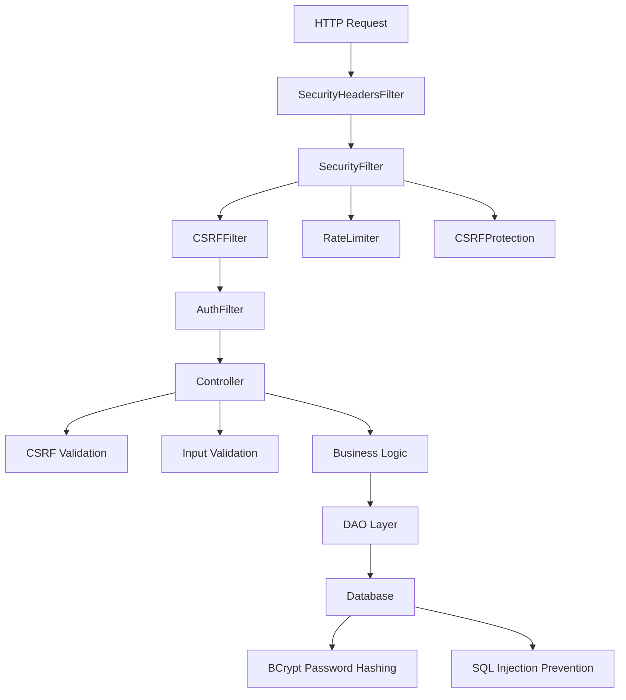
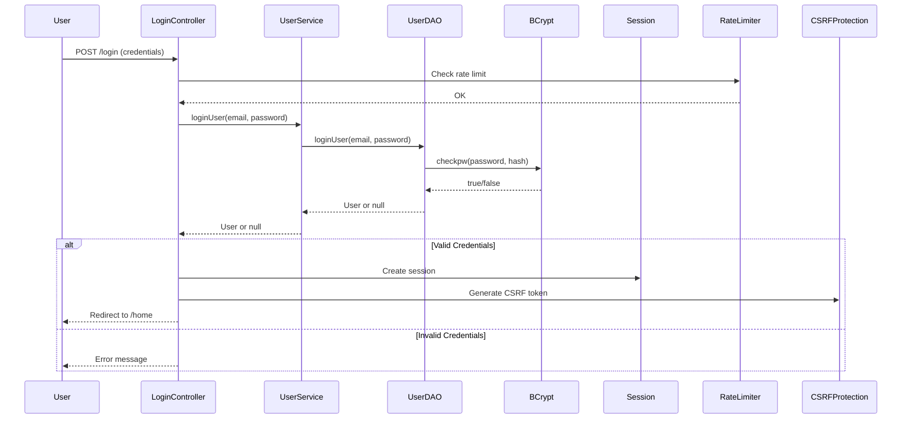
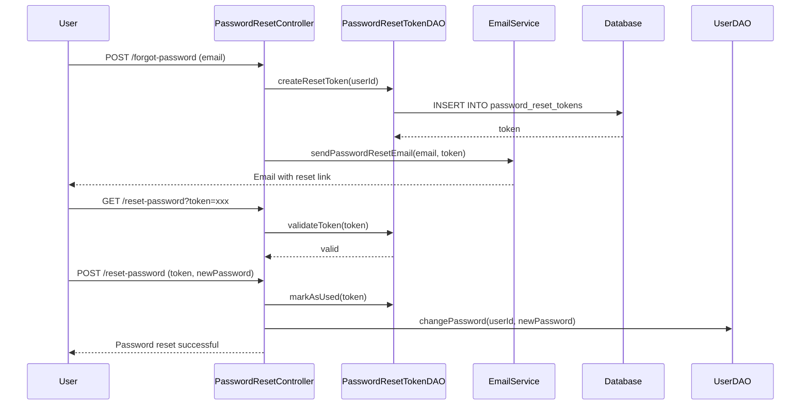

# FashionStore Security Documentation

## Overview

This document describes the security measures implemented in the FashionStore application to protect against common web vulnerabilities and ensure secure data handling.

## Security Architecture



## Security Layers

### 1. Filter Chain Security

The application uses a layered filter chain for comprehensive security:

```
Request → SecurityHeadersFilter → SecurityFilter → CSRFFilter → AuthFilter → Controller
```

#### SecurityHeadersFilter
Sets security headers on all HTTP responses:

**Headers Set:**
- `X-Frame-Options: DENY` - Prevents clickjacking
- `X-Content-Type-Options: nosniff` - Prevents MIME type sniffing
- `X-XSS-Protection: 1; mode=block` - Enables XSS protection
- `Strict-Transport-Security: max-age=31536000; includeSubDomains` - Enforces HTTPS
- `Content-Security-Policy: default-src 'self'; ...` - Restricts resource loading
- `Referrer-Policy: strict-origin-when-cross-origin` - Controls referrer information
- `Permissions-Policy: geolocation=(), microphone=(), camera=(), payment=()` - Restricts browser features

#### SecurityFilter
Handles CSRF protection and rate limiting:

- CSRF token generation for GET requests
- CSRF token validation for POST requests
- Rate limiting for login attempts

#### CSRFFilter
Additional CSRF protection for specific endpoints:

- Validates CSRF tokens on protected endpoints
- Returns 403 Forbidden on validation failure

#### AuthFilter
Enforces authentication and authorization:

- Checks session for authenticated user
- Redirects unauthenticated users to login
- Enforces admin role for admin paths
- Handles AJAX requests with JSON responses

---

## CSRF Protection

### Implementation

**Class:** `CSRFProtection.java`  
**Location:** `com.fashionstore.security.CSRFProtection`

### Token Generation

```java
public static String generateToken(HttpServletRequest request) {
    HttpSession session = request.getSession(false);
    if (session == null) return null;
    
    byte[] randomBytes = new byte[32];
    secureRandom.nextBytes(randomBytes);
    String token = Base64.getUrlEncoder().withoutPadding().encodeToString(randomBytes);
    
    session.setAttribute(CSRF_TOKEN_SESSION_KEY, token);
    session.setAttribute(CSRF_TOKEN_TIME_KEY, System.currentTimeMillis());
    
    return token;
}
```

**Features:**
- Cryptographically secure random token generation (32 bytes)
- Base64 URL-safe encoding
- Session-based storage
- 1-hour token expiration
- Used tokens cache to prevent replay attacks

### Token Validation

```java
public static boolean validateToken(HttpServletRequest request, String token) {
    if (token == null || token.trim().isEmpty()) return false;
    
    HttpSession session = request.getSession(false);
    if (session == null) return false;
    
    String sessionToken = (String) session.getAttribute(CSRF_TOKEN_SESSION_KEY);
    Long tokenTime = (Long) session.getAttribute(CSRF_TOKEN_TIME_KEY);
    
    if (sessionToken == null || tokenTime == null) return false;
    if (!token.equals(sessionToken)) return false;
    if (System.currentTimeMillis() - tokenTime > TOKEN_EXPIRY_TIME * 1000) return false;
    
    return true;
}
```

**Validation Steps:**
1. Check token is not null or empty
2. Check session exists
3. Check session token exists
4. Compare request token with session token
5. Check token expiration (1 hour)
6. Check if token has been used (replay protection)

### CSRF Token in Forms

```jsp
<input type="hidden" name="csrf_token" value="${csrfToken}" />
```

### CSRF Token in AJAX

```javascript
headers: {
  'X-CSRF-Token': '${csrfToken}'
}
```

### Protected Endpoints

All POST requests require CSRF token validation:
- `/login`
- `/register`
- `/cart/*`
- `/wishlist/*`
- `/checkout`
- `/payment/*`
- `/review/*`
- `/admin/*`

**Excluded Endpoints:**
CSRF validation is excluded for:
- Login form submission (handled by SecurityFilter)
- Register form submission (handled by SecurityFilter)

---

## Authentication & Authorization

### Authentication Flow



### Password Hashing

**Algorithm:** BCrypt  
**Class:** `UserDAOImpl.java`  
**Library:** jBCrypt

**Hashing on Registration:**
```java
String hashedPassword = BCrypt.hashpw(user.getPassword(), BCrypt.gensalt());
ps.setString(4, hashedPassword);
```

**Verification on Login:**
```java
if (BCrypt.checkpw(password, user.getPassword())) {
    return user;
}
```

**Features:**
- Automatic salt generation
- Work factor: 10 (default)
- Computationally expensive to prevent brute force
- Adaptive (can increase work factor as hardware improves)

### Session Management

**Session Attributes:**
- `userId`: User ID
- `user`: User object
- `csrfToken`: CSRF token

**Session Configuration:**
- Session timeout: 30 minutes (default)
- Secure cookies: Configured in web.xml
- HTTP-only cookies: Configured in web.xml

### Role-Based Access Control

**Roles:**
- `customer`: Regular user
- `admin`: Administrative user

**Authorization Check:**
```java
public boolean isAdmin() {
    return role != null && role.equalsIgnoreCase("admin");
}
```

**Protected Paths:**
- `/admin/*` - Admin only (AuthFilter enforces)
- `/cart/*` - Authenticated users only
- `/wishlist/*` - Authenticated users only
- `/checkout` - Authenticated users only
- `/orders` - Authenticated users only
- `/payment/*` - Authenticated users only

---

## Rate Limiting

### Implementation

**Class:** `RateLimiter.java`  
**Location:** `com.fashionstore.security.RateLimiter`

### Configuration

```java
private static final int MAX_ATTEMPTS = 5;
private static final long LOCKOUT_DURATION_MS = 15 * 60 * 1000; // 15 minutes
```

### Rate Limiting Logic

```java
public static boolean checkRateLimit(HttpServletRequest request, String endpoint) {
    String identifier = getClientIdentifier(request);
    Integer attempts = loginAttempts.getOrDefault(identifier, 0);
    Long lastAttempt = loginAttemptTimes.get(identifier);
    
    if (lastAttempt != null && System.currentTimeMillis() - lastAttempt > LOCKOUT_DURATION_MS) {
        resetRateLimit(request, endpoint);
        return true;
    }
    
    if (attempts >= MAX_ATTEMPTS) {
        return false; // Locked out
    }
    
    attempts++;
    loginAttempts.put(identifier, attempts);
    loginAttemptTimes.put(identifier, System.currentTimeMillis());
    
    return true;
}
```

### Protected Endpoints

- `/login` (POST): 5 attempts per 15 minutes per IP/email

### Lockout Behavior

- After 5 failed attempts: 15-minute lockout
- Lockout resets after 15 minutes
- Lockout resets on successful login

---

## Input Validation

### Validator Class

**Class:** `Validator.java`  
**Location:** `com.fashionstore.validation.Validator`

### Validation Rules

**Email Validation:**
```java
private static final Pattern EMAIL_PATTERN = 
    Pattern.compile("^[a-zA-Z0-9_+&*-]+(?:\\.[a-zA-Z0-9_+&*-]+)*@(?:[a-zA-Z0-9-]+\\.)+[a-zA-Z]{2,7}$");
```

**Phone Validation:**
```java
private static final Pattern PHONE_PATTERN = 
    Pattern.compile("^[6-9]\\d{9}$");
```

**Name Validation:**
```java
private static final Pattern NAME_PATTERN = 
    Pattern.compile("^[a-zA-Z\\s]{2,50}$");
```

**Password Validation:**
- Minimum 8 characters
- At least 1 uppercase letter
- At least 1 lowercase letter
- At least 1 digit

### Usage Example

```java
Validator validator = new Validator()
    .validateEmail(email, "Email")
    .validatePassword(password, "Password")
    .validatePhone(phone, "Phone");

if (validator.hasErrors()) {
    // Handle validation errors
}
```

---

## SQL Injection Prevention

### PreparedStatement Usage

All database queries use `PreparedStatement` to prevent SQL injection:

**Example:**
```java
String sql = "SELECT * FROM users WHERE email = ?";
try (PreparedStatement ps = con.prepareStatement(sql)) {
    ps.setString(1, email);
    ResultSet rs = ps.executeQuery();
}
```

### Benefits

- Automatic parameter escaping
- Type-safe parameter binding
- Query plan caching
- Protection against SQL injection

### Coverage

All DAO implementations use PreparedStatement:
- UserDAO
- ProductDAO
- CartDAO
- OrderDAO
- PaymentDAO
- ReviewDAO
- And all other DAOs

---

## XSS Prevention

### XSS Prevention Measures

1. **Output Encoding:** JSP automatically escapes output using JSTL `<c:out>` tag
2. **Input Validation:** Validator class sanitizes input
3. **Content Security Policy:** Restricts script sources
4. **X-XSS-Protection Header:** Enables browser XSS protection

### XSSUtil Class

**Class:** `XSSUtil.java`  
**Location:** `com.fashionstore.util.XSSUtil`

**Methods:**
```java
public static String escapeHtml(String input) {
    if (input == null) return null;
    return input.replace("&", "&amp;")
                 .replace("<", "&lt;")
                 .replace(">", "&gt;")
                 .replace("\"", "&quot;")
                 .replace("'", "&#x27;");
}
```

---

## Secure Session Management

### Session Configuration

**web.xml Configuration:**
```xml
<session-config>
    <session-timeout>30</session-timeout>
    <cookie-config>
        <http-only>true</http-only>
        <secure>true</secure>
        <same-site>Strict</same-site>
    </cookie-config>
    <tracking-mode>COOKIE</tracking-mode>
</session-config>
```

### Session Security Features

- **HTTP-only cookies:** Prevents JavaScript access to session ID
- **Secure cookies:** Only transmitted over HTTPS
- **Same-site cookies:** Prevents CSRF attacks
- **Session timeout:** 30 minutes of inactivity
- **Session fixation prevention:** New session on login

---

## Password Reset Security

### Token-Based Password Reset

**Class:** `PasswordResetToken.java`  
**DAO:** `PasswordResetTokenDAO.java`

### Token Features

- Cryptographically secure random token
- 1-hour expiration
- One-time use (marked as used after reset)
- Stored in database with user association

### Reset Flow



---

## Audit Logging

### AuditLogger Class

**Class:** `AuditLogger.java`  
**Location:** `com.fashionstore.util.AuditLogger`

### Logged Events

- User login (success/failure)
- User registration
- Password changes
- Order placement
- Payment transactions
- Admin operations

### Log Format

```java
AuditLogger.log("LOGIN_SUCCESS", "User logged in: " + email, String.valueOf(userId), request);
```

### Log Information

- Event type
- Description
- User ID
- Timestamp
- IP address
- User agent

---

## Security Best Practices Implemented

### 1. Defense in Depth

- Multiple security layers (filters, validation, encryption)
- Redundant security checks
- Fail-safe defaults

### 2. Least Privilege

- Database user with minimal permissions
- Role-based access control
- Admin-only endpoints protected

### 3. Secure Defaults

- BCrypt with default work factor
- 1-hour CSRF token expiration
- 30-minute session timeout
- Secure cookies by default

### 4. Input Validation

- Server-side validation
- Type-safe parameter binding
- Length restrictions
- Pattern matching

### 5. Output Encoding

- Automatic HTML escaping in JSP
- XSSUtil for manual escaping
- Content Security Policy

### 6. Secure Communication

- HTTPS enforcement (HSTS header)
- Secure cookies
- TLS configuration

### 7. Error Handling

- User-safe error messages
- No stack traces in production
- Generic error pages
- Logging for debugging

---

## Security Headers Summary

| Header | Value | Purpose |
|--------|-------|---------|
| X-Frame-Options | DENY | Prevents clickjacking |
| X-Content-Type-Options | nosniff | Prevents MIME sniffing |
| X-XSS-Protection | 1; mode=block | XSS protection |
| Strict-Transport-Security | max-age=31536000; includeSubDomains | HTTPS enforcement |
| Content-Security-Policy | default-src 'self'; ... | Resource loading restrictions |
| Referrer-Policy | strict-origin-when-cross-origin | Referrer control |
| Permissions-Policy | geolocation=(), microphone=(), camera=(), payment=() | Feature restrictions |

---

## Security Checklist

### Authentication
- [x] Password hashing with BCrypt
- [x] Secure session management
- [x] Role-based access control
- [x] Session timeout
- [x] Secure cookies

### Authorization
- [x] AuthFilter for authentication
- [x] Admin role check
- [x] Path-based protection
- [x] AJAX request handling

### CSRF Protection
- [x] CSRF token generation
- [x] CSRF token validation
- [x] Token expiration
- [x] Replay attack prevention
- [x] Form and AJAX support

### Input Validation
- [x] Email validation
- [x] Phone validation
- [x] Password complexity
- [x] Name validation
- [x] Length restrictions

### SQL Injection Prevention
- [x] PreparedStatement usage
- [x] Parameter binding
- [x] Type-safe queries
- [x] All DAOs covered

### XSS Prevention
- [x] Output encoding
- [x] Input sanitization
- [x] Content Security Policy
- [x] XSS protection header

### Rate Limiting
- [x] Login rate limiting
- [x] Lockout mechanism
- [x] IP-based tracking
- [x] Automatic reset

### Security Headers
- [x] X-Frame-Options
- [x] X-Content-Type-Options
- [x] X-XSS-Protection
- [x] Strict-Transport-Security
- [x] Content-Security-Policy
- [x] Referrer-Policy
- [x] Permissions-Policy

### Audit Logging
- [x] Security event logging
- [x] User action tracking
- [x] IP address logging
- [x] Timestamp logging

---

## Known Security Considerations

### 1. HTTPS Configuration
- HSTS header is set but requires HTTPS configuration in production
- SSL/TLS certificate needs to be configured

### 2. Session Storage
- Sessions stored in memory (Tomcat default)
- Consider session clustering for horizontal scaling

### 3. File Upload
- File upload validation should be enhanced
- Consider virus scanning for uploaded files

### 4. Password Policy
- Current password policy: 8 chars, 1 uppercase, 1 lowercase, 1 digit
- Consider adding special character requirement
- Consider password history checking

### 5. Two-Factor Authentication
- Not currently implemented
- Consider adding for admin accounts

### 6. API Rate Limiting
- Rate limiting only implemented for login
- Consider adding for other endpoints

---

## Security Testing Recommendations

### 1. Penetration Testing
- SQL injection testing
- XSS testing
- CSRF testing
- Session hijacking testing

### 2. Vulnerability Scanning
- OWASP ZAP
- Burp Suite
- Nessus

### 3. Code Review
- Security-focused code review
- Dependency vulnerability scanning
- Static analysis (SonarQube)

### 4. Configuration Review
- Tomcat security configuration
- Database security configuration
- Network security configuration

---

## Compliance Considerations

### GDPR Compliance
- User data protection
- Right to deletion
- Data portability
- Consent management

### PCI DSS Compliance
- Payment card data handling
- Encryption requirements
- Access control
- Logging and monitoring

---

## Security Incident Response

### Incident Response Plan

1. **Detection**
   - Monitor security logs
   - Alert on suspicious activity
   - Automated intrusion detection

2. **Containment**
   - Isolate affected systems
   - Block malicious IPs
   - Disable compromised accounts

3. **Eradication**
   - Remove malware
   - Patch vulnerabilities
   - Update security controls

4. **Recovery**
   - Restore from backups
   - Verify system integrity
   - Monitor for recurrence

5. **Lessons Learned**
   - Document incident
   - Update procedures
   - Train staff

---

## References

- [OWASP Top 10](https://owasp.org/www-project-top-ten/)
- [OWASP CSRF Prevention Cheat Sheet](https://cheatsheetseries.owasp.org/cheatsheets/Cross_Site_Request_Forgery_Prevention_Cheat_Sheet.html)
- [OWASP Session Management Cheat Sheet](https://cheatsheetseries.owasp.org/cheatsheets/Session_Management_Cheat_Sheet.html)
- [BCrypt Documentation](https://github.com/patrickfav/bcrypt)
- [Content Security Policy](https://developer.mozilla.org/en-US/docs/Web/HTTP/CSP)
